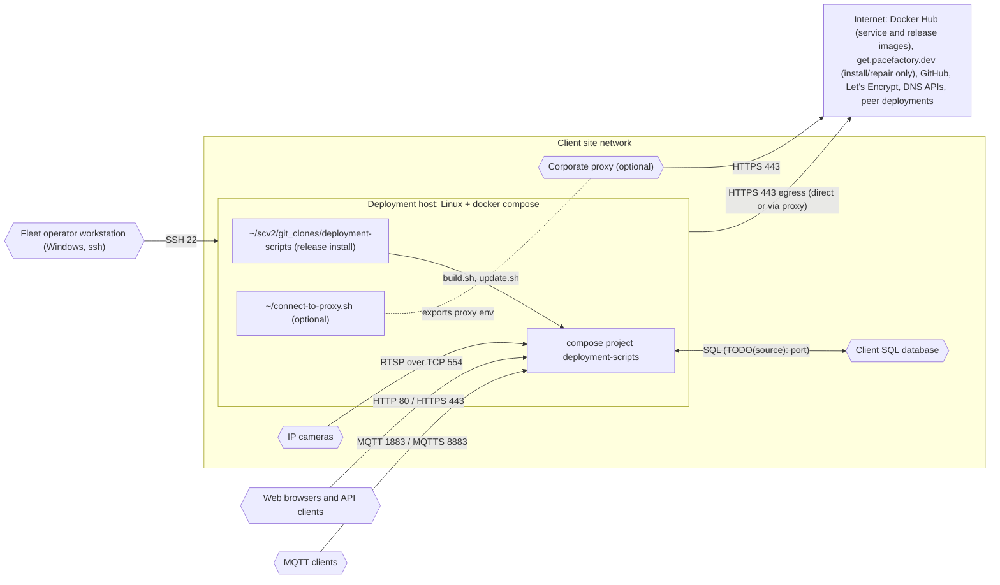

# Client site network requirements

**Carve-out.** This document records only what this repository's own scripts
and fragments evidence. A fuller requirements deck exists outside the repo and
will be reconciled against the per-repo sources of truth before its content is
adopted (architecture standard §7b). Everything not cited below is
`TODO(source)`.

## Deployment host

| Requirement | Evidence |
|---|---|
| Linux host running Docker with the docker compose plugin (Docker 28.x with compose 2.35+ confirmed) | `build.sh:16`, root README prerequisites |
| deployment-scripts installed at `~/scv2/git_clones/deployment-scripts` from the release image (`PF_INSTALL_DIR` default). A user named `pacefactory` is recommended rather than required; fleet updating assumes it | `scripts/remote/update-server.sh:57`, `scripts/release/fetch-release.sh:19-21`; [Install or repair deployment-scripts on a server](../../how-to/install-deployment-scripts.md) |
| `~/connect-to-proxy.sh` present when the site requires an egress proxy | `scripts/remote/update-server.sh:58,94-102` |
| The server's Docker Hub Organization Access Token in `~/scv2/docker_oat.sh` (mode 700, `export DOCKER_OAT=...`) and a standing `docker login` as `pacefactory`. Issuance: Pacefactory Deployment Guide (`TODO(source)`) | `scripts/common/dockerLogin.sh:5-13,32,81`; `update.sh:79-83` |
| mikefarah `yq` v4 on PATH, or Docker access to pull `mikefarah/yq` | `scripts/common/runYq.sh:26-32`; [Install yq](../../how-to/install-yq.md) |
| Optional, GPU deployments only: NVIDIA driver and nvidia container toolkit. Egress needed to install them: `TODO(source)`, to be filled in with the CUDA install guide | `compose/docker-compose.cuda.yml:14-24`; [Install CUDA support](../../how-to/install-cuda-support.md) |

## Inbound ports (host)

Only the ports of enabled profiles are published. Defaults:

| Port | Protocol | Profile | Notes |
|---|---|---|---|
| 80 | HTTP | base | redirects to HTTPS when an `https-*` profile is on |
| 443 | HTTPS | https-* | |
| 1883 | MQTT | mqtt-public (default on) | |
| 8883 | MQTTS | mqtts-public (default on with https-*) | |
| 9999 | HTTP | social (default on) | to be removed, [#204](https://github.com/pacefactory/deployment-scripts/issues/204) |
| 8282 | HTTP | rdb (default on) | to be removed, [#204](https://github.com/pacefactory/deployment-scripts/issues/204) |
| 1880 | HTTP | node-red (default on) | to be removed, [#204](https://github.com/pacefactory/deployment-scripts/issues/204) |
| 333 | HTTP | ntfy | deprecated, [#203](https://github.com/pacefactory/deployment-scripts/issues/203) |
| 7474 | HTTP | swift-labeler | to be removed, [#204](https://github.com/pacefactory/deployment-scripts/issues/204) |
| 7171, 7272 | HTTP | service-ports | profile to be dropped, [#205](https://github.com/pacefactory/deployment-scripts/issues/205) |
| ephemeral | HTTP | ape | two ports assigned by Docker; under investigation, [#206](https://github.com/pacefactory/deployment-scripts/issues/206) |
| 22 | SSH | (host) | fleet updates from the operator workstation |

Source: the `ports:` blocks of the fragments; see the [web clients](../integrations/web-clients.md) page.

## Outbound destinations (host and containers)

FQDNs are those the tooling contacts as written in this repository; the
Docker Hub pull path also uses `auth.docker.io` and `production.cloudflare.docker.com`
(`TODO(source)`: confirm the current Docker Hub hostnames).

| Destination | FQDN(s) to allow | Protocol / port | Purpose | Evidence |
|---|---|---|---|---|
| Site cameras | site-specific | RTSP over TCP 554 (8554 alternate) | video ingest | `record_cli.py:129`; [cameras](../integrations/cameras-rtsp.md) |
| Docker Hub | `registry-1.docker.io`, `auth.docker.io`, `production.cloudflare.docker.com` | HTTPS 443 | service image pulls (`update.sh`), the deployment-scripts release image (`fetch-release.sh`, `install.sh`), `mikefarah/yq` fallback | `update.sh:87`, `scripts/release/fetch-release.sh:121`, `scripts/common/runYq.sh:29` |
| Bootstrap host (GitHub Pages) | `get.pacefactory.dev` | HTTPS 443 | `install.sh` one-liner: **install and repair only**, not needed for routine updates | `scripts/release/fetch-release.sh:138`, `scripts/common/dockerLogin.sh:46`; [Install or repair](../../how-to/install-deployment-scripts.md) |
| GitHub | `github.com`, `objects.githubusercontent.com` | HTTPS 443 | yq and compose binaries (no `git pull` since the repository went private) | `scripts/installYq.sh:37`, `scripts/Dockerfile.build:15,19` |
| Let's Encrypt | `acme-v02.api.letsencrypt.org` | HTTPS 443 | certificate orders (certbot https-* profiles) | certbot fragments; [ACME and DNS](../integrations/acme-dns.md) |
| DigitalOcean API | `api.digitalocean.com` | HTTPS 443 | DNS-01 challenge (https-digitalocean) | `compose/docker-compose.https-digitalocean.yml:38-41` |
| GoDaddy API | `api.godaddy.com` | HTTPS 443 | DNS-01 challenge (https-godaddy) | `compose/docker-compose.https-godaddy.yml:36-41` |
| Peer Pacefactory deployment | per site (`PF_REMOTE_TRAINER_URLS`) | HTTPS 443 | remote training (expresso-010) | `compose/docker-compose.expresso-010.yml:23-35` |
| Client SQL database | per site | SQL, port `TODO(source)` | rdb integration | `compose/docker-compose.rdb.yml:5-7` |

The Let's Encrypt, DigitalOcean and GoDaddy hostnames are the plugins' and
CA's published endpoints, not literals in this repository (`TODO(source)`).

## Not evidenced in this repository (do not assume)

- Active Directory / SSSD join of the host, Teleport access path, DNS
  requirements, NTP: `TODO(source)`. To be filled from the requirements deck
  once verified.

## Diagram

Source: [`site-network.mmd`](site-network.mmd).

