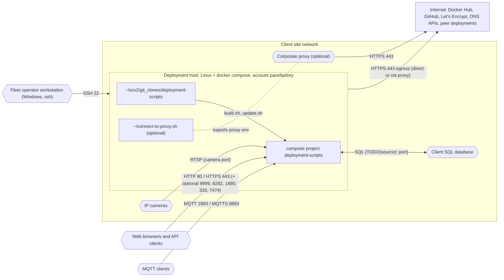

# Client site network requirements

**Carve-out.** This document records only what this repository's own scripts
and fragments evidence. A fuller requirements deck exists outside the repo and
will be reconciled against the per-repo sources of truth before its content is
adopted (architecture standard §7b). Everything not cited below is
`TODO(source)`.

## Deployment host

| Requirement | Evidence |
|---|---|
| Linux host running Docker with the docker compose plugin (Docker 28.x with compose 2.35+ confirmed) | `build.sh:16`, root README prerequisites |
| Repository checked out at `~/scv2/git_clones/deployment-scripts` under the `pacefactory` account | `scripts/remote/update-server.sh:38`; `scripts/remote/README.md` prerequisites (now [how-to](../../how-to/update-fleet-from-windows.md)) |
| `~/connect-to-proxy.sh` present when the site requires an egress proxy | `scripts/remote/update-server.sh:39,72-80` |
| Docker Hub credentials stored for the account (`docker login`) | `update.sh:79-83` |
| mikefarah `yq` v4 on PATH, or Docker access to pull `mikefarah/yq` | `scripts/common/runYq.sh:26-32` |
| Kerberos credential cache, if any, is not forwarded to containers | `build.sh:12-13` |
| NVIDIA driver and nvidia container runtime for GPU profiles | `compose/docker-compose.cuda.yml:14-24` and the two Expresso GPU fragments |
| Swap enabled on database hosts (recommendation) | [MongoDB reference](../../reference/mongodb.md) |

## Inbound ports (host)

Only the ports of enabled profiles are published. Defaults:

| Port | Protocol | Profile | Notes |
|---|---|---|---|
| 80 | HTTP | base | redirects to HTTPS when an `https-*` profile is on |
| 443 | HTTPS | https-* | |
| 1883 | MQTT | mqtt-public (default on) | disable on internet-facing sites |
| 8883 | MQTTS | mqtts-public (default on with https-*) | |
| 9999 | HTTP | social (default on) | |
| 8282 | HTTP | rdb (default on) | |
| 1880 | HTTP | node-red (default on) | |
| 333 | HTTP | ntfy | |
| 7474 | HTTP | swift-labeler | |
| 7171, 7272 | HTTP | service-ports | |
| ephemeral | HTTP | ape | two ports assigned by Docker |
| 22 | SSH | (host) | fleet updates from the operator workstation |

Source: the `ports:` blocks of the fragments; see the [web clients](../integrations/web-clients.md) page.

## Outbound destinations (host and containers)

| Destination | Purpose | Evidence |
|---|---|---|
| Site cameras, RTSP port | video ingest | `record_cli.py`; realtime |
| Docker Hub | image pulls | `update.sh:87` |
| GitHub | `git pull`; yq and compose binaries | `scripts/remote/update-server.sh:88`, `scripts/installYq.sh`, `scripts/Dockerfile.build` |
| Let's Encrypt, DigitalOcean or GoDaddy API | certificates | certbot fragments |
| Peer Pacefactory deployment (HTTPS) | remote training | `compose/docker-compose.expresso-010.yml:23-35` |
| Client SQL database | rdb integration | `compose/docker-compose.rdb.yml:5-7` (host and port `TODO(source)`) |

## Not evidenced in this repository (do not assume)

- Active Directory / SSSD join of the host, Teleport access path, DNS
  requirements, NTP: `TODO(source)`. To be filled from the requirements deck
  once verified.

## Diagram

Source: [`site-network.mmd`](site-network.mmd).

