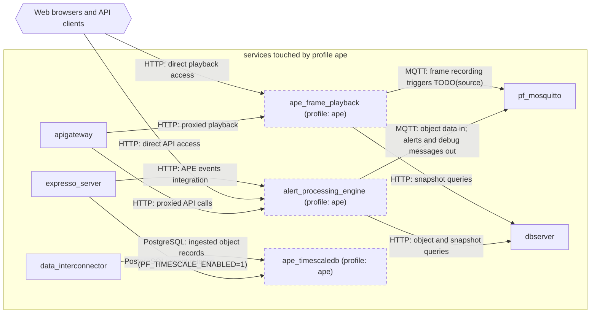

# Profile: `ape`

**Display name:** APE profile

The Alert Processing Engine produces realtime alerts from MQTT object data.

| Attribute | Value |
|---|---|
| Fragment | `compose/docker-compose.ape.yml` |
| Class | prompted, default off |
| Prompt | Enable the Alert Processing Engine (APE) profile? |
| Parent profile(s) | none |
| Sub-profiles | none |
| Requires (`required-profiles`) | [`expresso-010`](expresso-010.md), [`rdb`](rdb.md) |
| Required by | none |
| Conflicts with (inferred) | none found |

## Services added

| Service | Node ID | Image | Owning repo | Purpose |
|---|---|---|---|---|
| `alert_processing_engine` | `alert_processing_engine` | `pacefactory/alert_processing_engine:${APE_TAG:-latest}` | [alert_processing_engine](https://github.com/pacefactory/alert_processing_engine) (inferred) | Alert Processing Engine: real-time alerts from MQTT object data |
| `ape_frame_playback` | `ape_frame_playback` | `pacefactory/alert_processing_engine:${APE_TAG:-latest}` | [alert_processing_engine](https://github.com/pacefactory/alert_processing_engine) (inferred) | Frame playback HTTP service for APE recordings |
| `ape_timescaledb` | `ape_timescaledb` | `timescale/timescaledb:latest-pg16` | [timescaledb](https://hub.docker.com/r/timescale/timescaledb) (third-party) | TimescaleDB (PostgreSQL 16) event store used by APE, Expresso and data_interconnector |

## Services modified from other profiles

| Service | Home profile | Keys this profile adds or overrides |
|---|---|---|
| `apigateway` | [`base`](base.md) | environment, depends_on |
| `expresso_server` | [`expresso-010`](expresso-010.md) | environment, depends_on |
| `data_interconnector` | [`base`](base.md) | environment |

## Networks and volumes added

- Networks: none
- Named volumes: ape-data, ape_timescaledb-data

## Settings (`x-pf-info.settings`)

| Variable | Default (as written) | Hidden | default_var | Description |
|---|---|---|---|---|
| `APE_TAG` | `latest` | false |  | (none in fragment) |
| `PUBLISH_DEBUG_MSGS` | `false` | false |  | Should APE publish debug messages over MQTT? |

See the [environment variable reference](../../reference/environment-variables.md) for where each value reaches.

## Inputs / Outputs

Flows this profile originates or terminates. Node IDs are defined in the [glossary](../glossary.md).

| From | To | Direction | Protocol | Port / endpoint / topic / table | Payload | Trigger | Profile | Details |
|---|---|---|---|---|---|---|---|---|
| `alert_processing_engine` | `pf_mosquitto` | internal | MQTT | mqtt://pf_mosquitto:1883 | object data in; alerts and debug messages out | continuous | ape | source: `compose/docker-compose.ape.yml:32,35`; [link](https://github.com/pacefactory/alert_processing_engine/blob/main/docs/architecture/README.md) |
| `alert_processing_engine` | `dbserver` | internal | HTTP | dbserver:8050 | object and snapshot queries | on event | ape | source: `compose/docker-compose.ape.yml:33`; [link](https://github.com/pacefactory/alert_processing_engine/blob/main/docs/architecture/README.md) |
| `ape_frame_playback` | `pf_mosquitto` | internal | MQTT | mqtt://pf_mosquitto:1883 | frame recording triggers TODO(source) | continuous | ape | source: `compose/docker-compose.ape.yml:58`; [link](https://github.com/pacefactory/alert_processing_engine/blob/main/docs/architecture/README.md) |
| `ape_frame_playback` | `dbserver` | internal | HTTP | dbserver:8050 | snapshot queries | on demand | ape | source: `compose/docker-compose.ape.yml:59`; [link](https://github.com/pacefactory/alert_processing_engine/blob/main/docs/architecture/README.md) |
| `apigateway` | `alert_processing_engine` | internal | HTTP | alert_processing_engine:5380 | proxied API calls | on demand | ape | source: `compose/docker-compose.ape.yml:67-68`; [link](https://github.com/pacefactory/scv2_apigateway/blob/main/docs/architecture/README.md) |
| `apigateway` | `ape_frame_playback` | internal | HTTP | ape_frame_playback:5381 | proxied playback | on demand | ape | source: `compose/docker-compose.ape.yml:69-70`; [link](https://github.com/pacefactory/scv2_apigateway/blob/main/docs/architecture/README.md) |
| `ext_web_clients` | `alert_processing_engine` | in | HTTP | ephemeral host port -> 5380 | direct API access | on demand | ape | source: `compose/docker-compose.ape.yml:38-39`; [link](https://github.com/pacefactory/alert_processing_engine/blob/main/docs/architecture/README.md) |
| `ext_web_clients` | `ape_frame_playback` | in | HTTP | ephemeral host port -> 5381 | direct playback access | on demand | ape | source: `compose/docker-compose.ape.yml:62-63`; [link](https://github.com/pacefactory/alert_processing_engine/blob/main/docs/architecture/README.md) |
| `expresso_server` | `alert_processing_engine` | internal | HTTP | alert_processing_engine:5380 | APE events integration | on demand | ape | source: `compose/docker-compose.ape.yml:101`; [link](https://github.com/pacefactory/expresso_server/blob/main/docs/architecture/README.md) |
| `expresso_server` | `ape_timescaledb` | internal | PostgreSQL | ape_timescaledb:5432 db tsdb | event queries | on demand | ape | source: `compose/docker-compose.ape.yml:102-106`; [link](https://github.com/pacefactory/expresso_server/blob/main/docs/architecture/README.md) |
| `data_interconnector` | `ape_timescaledb` | internal | PostgreSQL | ape_timescaledb:5432 db tsdb | ingested object records (PF_TIMESCALE_ENABLED=1) | continuous | ape | source: `compose/docker-compose.ape.yml:113-119`; [link](https://github.com/pacefactory/data_interconnector/blob/main/docs/architecture/README.md) |

## Diagram

Source: [`ape.mmd`](ape.mmd). Dashed boxes are services from optional profiles; hexagons are external systems.

