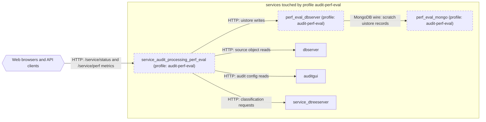

# Profile: `audit-perf-eval`

**Display name:** audit perf-eval shadow profile

Runs a second audit-processing container that reads source data from the production dbserver but writes all uistore output to a scratch dbserver+mongo pair on dedicated volumes (nothing is written to production; MQTT export is disabled). Used to benchmark the segment trim/stitch/lookback feature (run A = PERF_EVAL_TRIM_STITCH false, run B = true) with PF_PERF_EVAL_MODE metrics. See docs/PERF_EVAL_RUNBOOK.md in scv3_services_processing. On sites using autozone entries, also set PERF_EVAL_AUTOZONE_URL (e.g. http://autozone_api:4545). (perf_eval_mongo, perf_eval_dbserver, service_audit_processing_perf_eval)

| Attribute | Value |
|---|---|
| Fragment | `compose/docker-compose.audit-perf-eval.yml` |
| Class | prompted, default off |
| Prompt | Enable the audit processing performance-evaluation shadow instance? |
| Parent profile(s) | none |
| Sub-profiles | none |
| Requires (`required-profiles`) | none |
| Required by | none |
| Conflicts with (inferred) | none found |

## Services added

| Service | Node ID | Image | Owning repo | Purpose |
|---|---|---|---|---|
| `perf_eval_mongo` | `perf_eval_mongo` | `mongo:4.2.3-bionic` | [mongo](https://hub.docker.com/_/mongo) (third-party) | Scratch mongo for the audit perf-eval shadow instance |
| `perf_eval_dbserver` | `perf_eval_dbserver` | `pacefactory/dbserver:${PERF_EVAL_DBSERVER_TAG:-latest}` | [scv2_dbserver](https://github.com/pacefactory/scv2_dbserver) (named) | Scratch dbserver for the audit perf-eval shadow instance |
| `service_audit_processing_perf_eval` | `service_audit_processing_perf_eval` | `pacefactory/service-audit-processing:${PERF_EVAL_AUDIT_PROCESSING_TAG:-latest}` | [scv3_services_processing](https://github.com/pacefactory/scv3_services_processing) (named) | Shadow audit processing instance for A/B benchmarking |

## Services modified from other profiles

None.

## Networks and volumes added

- Networks: none
- Named volumes: perf_eval-mongodata, perf_eval-dbserver-data, perf_eval-audit_processing-data

## Settings (`x-pf-info.settings`)

| Variable | Default (as written) | Hidden | default_var | Description |
|---|---|---|---|---|
| `PERF_EVAL_AUDIT_PROCESSING_TAG` | `latest` | false |  | Image tag for the shadow audit processing service (e.g. a PR build like pr-126) |
| `PERF_EVAL_DBSERVER_TAG` | `latest` | false |  | Image tag for the scratch dbserver (must include the compound uistore index fix) |
| `PERF_EVAL_TRIM_STITCH` | `false` | false |  | The A/B switch — false = run A baseline (legacy), true = run B (trim/stitch/lookback on) |
| `PERF_EVAL_START_TIME` | `""` | false |  | Start of the pinned benchmark window (epoch ms or ISO date, e.g. 2026-07-20). Empty = derive from PERF_EVAL_REPORT_RANGE_HOURS (live-tail) |
| `PERF_EVAL_END_TIME` | `""` | false |  | End of the pinned benchmark window (epoch ms or ISO date). Empty = now |
| `PERF_EVAL_PROCESS_CAMERAS` | `""` | false |  | Comma-separated camera names to benchmark. Empty = all cameras (not recommended) |
| `PERF_EVAL_RUN_ONCE` | `true` | false |  | Process the window once and exit (false = live-tail mode, keeps cycling like prod) |
| `PERF_EVAL_REPORT_RANGE_HOURS` | `48` | false |  | Report range when no explicit window is pinned (live-tail mode) |
| `PERF_EVAL_HTTP_PORT` | `3006` | false |  | Host port (bound to 127.0.0.1) for the shadow service's /service/status + /service/perf |
| `PERF_EVAL_AUTOZONE_URL` | `""` | false |  | Autozone API URL for the shadow instance (only needed when autozone entries are audited, e.g. http://autozone_api:4545). Empty = disabled |
| `PERF_EVAL_MONGO_MEMORY_LIMIT` | `2g` | false |  | Hard memory limit for the scratch mongo container (uistore output only, so small) |
| `PERF_EVAL_MONGO_WIREDTIGER_CACHE_GB` | `0.5` | false |  | WiredTiger cache size (GB) for the scratch mongo |

See the [environment variable reference](../../reference/environment-variables.md) for where each value reaches.

## Inputs / Outputs

Flows this profile originates or terminates. Node IDs are defined in the [glossary](../glossary.md).

| From | To | Direction | Protocol | Port / endpoint / topic / table | Payload | Trigger | Profile | Details |
|---|---|---|---|---|---|---|---|---|
| `perf_eval_dbserver` | `perf_eval_mongo` | internal | MongoDB wire | perf_eval_mongo:27017 | scratch uistore records | on demand | audit-perf-eval | source: `compose/docker-compose.audit-perf-eval.yml:146`; [link](https://github.com/pacefactory/scv2_dbserver/blob/main/docs/architecture/README.md) |
| `service_audit_processing_perf_eval` | `dbserver` | internal | HTTP | dbserver:8050 (reads only) | source object reads | polling | audit-perf-eval | source: `compose/docker-compose.audit-perf-eval.yml:176,180`; [link](https://github.com/pacefactory/scv3_services_processing/blob/main/docs/architecture/README.md) |
| `service_audit_processing_perf_eval` | `perf_eval_dbserver` | internal | HTTP | perf_eval_dbserver:8050 | uistore writes | polling | audit-perf-eval | source: `compose/docker-compose.audit-perf-eval.yml:177`; [link](https://github.com/pacefactory/scv3_services_processing/blob/main/docs/architecture/README.md) |
| `service_audit_processing_perf_eval` | `auditgui` | internal | HTTP | auditgui:80 (GET only) | audit config reads | polling | audit-perf-eval | source: `compose/docker-compose.audit-perf-eval.yml:182`; [link](https://github.com/pacefactory/scv3_services_processing/blob/main/docs/architecture/README.md) |
| `service_audit_processing_perf_eval` | `service_dtreeserver` | internal | HTTP | service_dtreeserver:7272 | classification requests | on event | audit-perf-eval | source: `compose/docker-compose.audit-perf-eval.yml:183`; [link](https://github.com/pacefactory/scv3_services_processing/blob/main/docs/architecture/README.md) |
| `ext_web_clients` | `service_audit_processing_perf_eval` | in | HTTP | 127.0.0.1:PERF_EVAL_HTTP_PORT (default 3006) -> 3005 | /service/status and /service/perf metrics | on demand | audit-perf-eval | source: `compose/docker-compose.audit-perf-eval.yml:201-203`; [link](https://github.com/pacefactory/scv3_services_processing/blob/main/docs/architecture/README.md) |

## Diagram

Source: [`audit-perf-eval.mmd`](audit-perf-eval.mmd). Dashed boxes are services from optional profiles; hexagons are external systems.

