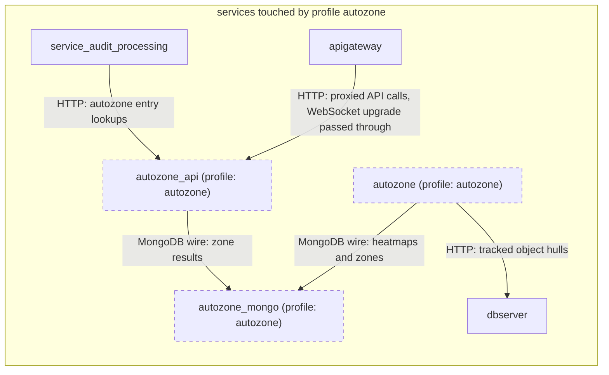

# Profile: `autozone`

**Display name:** Autozone profile

Autozone detects activity zones from tracked object hulls by creating heatmaps and applying thresholds

| Attribute | Value |
|---|---|
| Fragment | `compose/docker-compose.autozone.yml` |
| Class | prompted, default off |
| Prompt | Enable the Autozone profile? |
| Parent profile(s) | none |
| Sub-profiles | none |
| Requires (`required-profiles`) | none |
| Required by | none |
| Conflicts with (inferred) | none found |

## Services added

| Service | Node ID | Image | Owning repo | Purpose |
|---|---|---|---|---|
| `autozone` | `autozone` | `pacefactory/autozone:${AUTOZONE_TAG:-latest}` | [autozone](https://github.com/pacefactory/autozone) (internal) | Detects activity zones from tracked object hulls |
| `autozone_api` | `autozone_api` | `pacefactory/autozone_api:${AUTOZONE_TAG:-latest}` | [autozone](https://github.com/pacefactory/autozone) (internal) | API in front of autozone results |
| `autozone_mongo` | `autozone_mongo` | `mongo:7.0` | [mongo](https://hub.docker.com/_/mongo) (third-party) | MongoDB 7 store for autozone |

## Services modified from other profiles

| Service | Home profile | Keys this profile adds or overrides |
|---|---|---|
| `apigateway` | [`base`](base.md) | depends_on, environment |
| `service_audit_processing` | [`base`](base.md) | depends_on, environment |

## Networks and volumes added

- Networks: autozone_network
- Named volumes: autozone_mongo-data, autozone-data

## Settings (`x-pf-info.settings`)

| Variable | Default (as written) | Hidden | default_var | Description |
|---|---|---|---|---|
| `AUTOZONE_TAG` | `latest` | false |  | (none in fragment) |

See the [environment variable reference](../../reference/environment-variables.md) for where each value reaches.

## Inputs / Outputs

Flows this profile originates or terminates. Node IDs are defined in the [glossary](../glossary.md).

| From | To | Direction | Protocol | Port / endpoint / topic / table | Payload | Trigger | Profile | Details |
|---|---|---|---|---|---|---|---|---|
| `autozone` | `autozone_mongo` | internal | MongoDB wire | autozone_mongo:27017 | heatmaps and zones | on demand | autozone | source: `compose/docker-compose.autozone.yml:24`; [link](https://github.com/pacefactory/autozone/blob/main/docs/architecture/README.md) |
| `autozone` | `dbserver` | internal | HTTP | dbserver:8050 | tracked object hulls | polling TODO(source) | autozone | source: `compose/docker-compose.autozone.yml:25`; [link](https://github.com/pacefactory/autozone/blob/main/docs/architecture/README.md) |
| `autozone_api` | `autozone_mongo` | internal | MongoDB wire | autozone_mongo:27017 | zone results | on demand | autozone | source: `compose/docker-compose.autozone.yml:42`; [link](https://github.com/pacefactory/autozone/blob/main/docs/architecture/README.md) |
| `apigateway` | `autozone_api` | internal | HTTP | autozone_api:4545 (/api/autozone/) | proxied API calls, WebSocket upgrade passed through | on demand | autozone | source: `compose/docker-compose.autozone.yml:63-64`; [link](https://github.com/pacefactory/scv2_apigateway/blob/master/docs/reference/api.md) |
| `service_audit_processing` | `autozone_api` | internal | HTTP | autozone_api:4545 | autozone entry lookups | on demand | autozone | source: `compose/docker-compose.autozone.yml:70`; [link](https://github.com/pacefactory/scv3_services_processing/blob/main/docs/architecture/README.md) |

## Diagram

Source: [`autozone.mmd`](autozone.mmd). Dashed boxes are services from optional profiles; hexagons are external systems.

