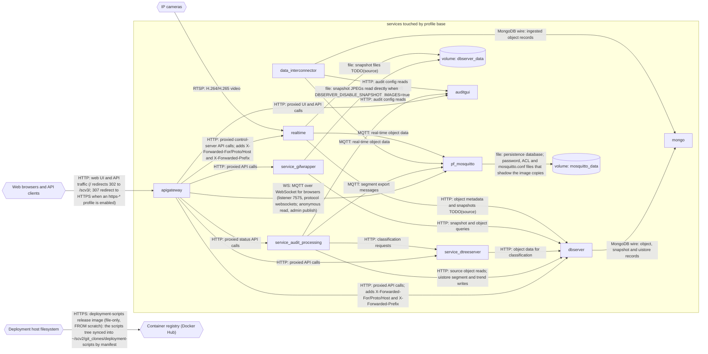

# Profile: `base`

**Display name:** base

TODO(source): no `x-pf-info.description` in the fragment.

| Attribute | Value |
|---|---|
| Fragment | `compose/docker-compose.base.yml` |
| Class | forced (build.sh) |
| Prompt | (default: "Enable base?") |
| Parent profile(s) | none |
| Sub-profiles | [`cuda`](cuda.md), [`mqtt-public`](mqtt-public.md) |
| Requires (`required-profiles`) | none |
| Required by | none |
| Conflicts with (inferred) | none found |

## Services added

| Service | Node ID | Image | Owning repo | Purpose |
|---|---|---|---|---|
| `mongo` | `mongo` | `mongo:4.2.3-bionic` | [mongo](https://hub.docker.com/_/mongo) (third-party) | Primary MongoDB 4.2 store behind dbserver and data_interconnector, run as a single-node replica set |
| `dbserver` | `dbserver` | `pacefactory/dbserver:${DBSERVER_TAG:-latest}` | [scv2_dbserver](https://github.com/pacefactory/scv2_dbserver) (internal) | HTTP data API over mongo; owns the snapshot/object data volume |
| `pf_mosquitto` | `pf_mosquitto` | `pacefactory/pf_mosquitto:${PF_MOSQUITTO_TAG:-latest}` | [pf_mosquitto](https://github.com/pacefactory/pf_mosquitto) (internal) | Eclipse Mosquitto MQTT broker (plain 1883, WebSocket 7575, TLS 8883 when a certificate is mounted) used by every real-time producer and consumer in the deployment |
| `data_interconnector` | `data_interconnector` | `pacefactory/data_interconnector:${DATA_INTERCONNECTOR_TAG:-latest}` | [data_interconnector](https://github.com/pacefactory/data_interconnector) (internal) | Ingests MQTT object data into mongo (and TimescaleDB when ape is enabled) |
| `realtime` | `realtime` | `pacefactory/realtime:${REALTIME_TAG:-${REALTIME_TAG_DEFAULT_GPU:-latest}}` | [scv2_realtime](https://github.com/pacefactory/scv2_realtime) (internal) | Camera ingest and real-time processing; publishes to MQTT and writes to dbserver |
| `auditgui` | `auditgui` | `pacefactory/scv3_webgui:${AUDITGUI_TAG:-latest}` | [scv3_webgui](https://github.com/pacefactory/scv3_webgui) (internal) | Audit web UI and the uiserver API other services read audit config from |
| `service_gifwrapper` | `service_gifwrapper` | `pacefactory/service-gifwrapper:${GIFWRAPPER_TAG:-latest}` | [scv2_services_gifwrapper](https://github.com/pacefactory/scv2_services_gifwrapper) (internal) | Renders ghosted snapshot images and GIFs from the dbserver data volume |
| `service_dtreeserver` | `service_dtreeserver` | `pacefactory/service-dtreeserver:${DTREESERVER_TAG:-latest}` | [scv2_services_dtreeserver](https://github.com/pacefactory/scv2_services_dtreeserver) (internal) | Decision-tree classifier service used by audit processing |
| `service_audit_processing` | `service_audit_processing` | `pacefactory/service-audit-processing:${AUDIT_PROCESSING_TAG:-latest}` | [scv3_services_processing](https://github.com/pacefactory/scv3_services_processing) (internal) | Batch audit processing over dbserver data; exports segments over MQTT |
| `apigateway` | `apigateway` | `pacefactory/apigateway:${APIGATEWAY_TAG:-latest}` | [scv2_apigateway](https://github.com/pacefactory/scv2_apigateway) (internal) | nginx reverse proxy in front of every web UI and /api/* path; serves HTTP on 80 and, with an https-* profile, HTTPS on 443 |

## Services modified from other profiles

None.

## Networks and volumes added

- Networks: internal_network, external_network
- Named volumes: mongodata, dbserver-data, realtime-data, service_dtreeserver-data, webgui-data, mosquitto-data, data_interconnector-data, audit_processing-data

## Settings (`x-pf-info.settings`)

| Variable | Default (as written) | Hidden | default_var | Description |
|---|---|---|---|---|
| `PROJECT_PREFIX` | `""` | false |  | (none in fragment) |
| `APIGATEWAY_TAG` | `latest` | false |  | (none in fragment) |
| `DBSERVER_TAG` | `latest` | false |  | (none in fragment) |
| `REALTIME_TAG` | `latest` | false | `REALTIME_TAG_DEFAULT_GPU` | (none in fragment) |
| `AUDITGUI_TAG` | `latest` | false |  | (none in fragment) |
| `WEBGUI_FORCE_GHOSTING` | `true` | false |  | Force ghosting of all cameras |
| `WEBGUI_UNGHOSTED_CAMERA_LIST` | `""` | false |  | List of cameras that should not be ghosted. Should be a comma separated list of camera names |
| `WEBGUI_DEFAULT_GHOSTING_TYPE` | `ghosted` | false |  | Ghosting style the webgui starts with. One of: no_image, edges, edges_inverted, ghosted, ghosted_blur, color_invert |
| `DBSERVER_DISABLE_SNAPSHOT_IMAGES` | `true` | false |  | Disable unghosted snapshot image endpoints in dbserver (hard ghosting enforcement) |
| `AUDIT_PROCESSING_TAG` | `latest` | false |  | (none in fragment) |
| `PF_REPORT_RANGE_HOURS` | `168` | false |  | Time window audit processing will compute retroactively (hours) |
| `PF_PROCESS_BLOCK_DURATION_MINUTES` | `15` | false |  | Size of blocks audit processing will compute (minutes) |
| `PF_PROCESS_BLOCK_PREVIOUS_MINUTES` | `5` | false |  | Duration of redundant/overlapping data precedeing each processing block's start time (minutes) |
| `PF_PROCESS_BLOCK_LAG_MINUTES` | `5` | false |  | Duration to wait after end of a processing block for late-arriving data to arrive in dbserver (minutes) |
| `PF_PROCESS_BLOCK_MAX_LOOKBACK_MINUTES` | `240` | false |  | Upper bound on the per-entry source-data lookback derived from duration parameters in each entry's dependency chain (minutes) |
| `PF_ENABLE_SEGMENT_TRIM_STITCH` | `false` | false |  | Globally enable per-entry segment trimming, stitching, and derived source-data lookback in audit processing (true/false) |
| `GIFWRAPPER_TAG` | `latest` | false |  | (none in fragment) |
| `DTREESERVER_TAG` | `latest` | false |  | (none in fragment) |
| `PF_MOSQUITTO_TAG` | `latest` | false |  | (none in fragment) |
| `DATA_INTERCONNECTOR_TAG` | `latest` | false |  | (none in fragment) |
| `MONGO_MEMORY_LIMIT` | `3g` | false | `MONGO_MEMORY_LIMIT_DEFAULT` | Hard memory limit for the mongo container, with units (e.g. 3g). Default scales with host RAM; see docs/reference/mongodb.md for sizing guidance |
| `MONGO_WIREDTIGER_CACHE_GB` | `1` | false | `MONGO_WIREDTIGER_CACHE_GB_DEFAULT` | MongoDB WiredTiger cache size in GB. Rule of thumb is 50% of (MONGO_MEMORY_LIMIT - 1GB). Default scales with host RAM |
| `MONGO_OPLOG_SIZE_MB` | `2048` | false |  | Maximum size (in MB) of the MongoDB replica set oplog |
| `HTTP_PORT` | `80` | false |  | (none in fragment) |

See the [environment variable reference](../../reference/environment-variables.md) for where each value reaches.

## Inputs / Outputs

Flows this profile originates or terminates. Node IDs are defined in the [glossary](../glossary.md).

| From | To | Direction | Protocol | Port / endpoint / topic / table | Payload | Trigger | Profile | Details |
|---|---|---|---|---|---|---|---|---|
| `ext_cameras` | `realtime` | in | RTSP | rtsp:// URL per camera (from realtime-data config) | H.264/H.265 video | continuous | base | source: `record_cli.py:15,96-97,129-134 (RTSP config shared with realtime; realtime's own ingest is TODO(source))`; [link](https://github.com/pacefactory/scv2_realtime/blob/main/docs/architecture/README.md) |
| `realtime` | `dbserver` | internal | HTTP | dbserver:8050 | object metadata and snapshots TODO(source) | continuous | base | source: `compose/docker-compose.base.yml:232`; [link](https://github.com/pacefactory/scv2_realtime/blob/main/docs/architecture/README.md) |
| `realtime` | `pf_mosquitto` | internal | MQTT | pf_mosquitto:1883 | real-time object data | continuous | base | source: `compose/docker-compose.base.yml:234-235`; [link](https://github.com/pacefactory/scv2_realtime/blob/main/docs/architecture/README.md) |
| `realtime` | `vol_dbserver_data` | internal | file | /home/scv2/dbserver_volume (rw mount of dbserver-data) | snapshot files TODO(source) | continuous | base | source: `compose/docker-compose.base.yml:236-239`; [link](https://github.com/pacefactory/scv2_realtime/blob/main/docs/architecture/README.md) |
| `data_interconnector` | `pf_mosquitto` | internal | MQTT | pf_mosquitto:1883 (subscribe) | real-time object data | continuous | base | source: `compose/docker-compose.base.yml:206-207`; [link](https://github.com/pacefactory/data_interconnector/blob/main/docs/architecture/README.md) |
| `data_interconnector` | `mongo` | internal | MongoDB wire | mongo:27017 | ingested object records | continuous | base | source: `compose/docker-compose.base.yml:208-209`; [link](https://github.com/pacefactory/data_interconnector/blob/main/docs/architecture/README.md) |
| `data_interconnector` | `auditgui` | internal | HTTP | auditgui:80 (disabled: PF_UISERVER_DISABLED=1) | audit config reads (currently disabled) | polling TODO(source) | base | source: `compose/docker-compose.base.yml:210-212`; [link](https://github.com/pacefactory/data_interconnector/blob/main/docs/architecture/README.md) |
| `dbserver` | `mongo` | internal | MongoDB wire | mongo:27017 | object, snapshot and uistore records | on demand | base | source: `compose/docker-compose.base.yml:158`; [link](https://github.com/pacefactory/scv2_dbserver/blob/main/docs/architecture/README.md) |
| `service_gifwrapper` | `dbserver` | internal | HTTP | dbserver:8050 | snapshot and object queries | on demand | base | source: `compose/docker-compose.base.yml:288`; [link](https://github.com/pacefactory/scv2_services_gifwrapper/blob/main/docs/architecture/README.md) |
| `service_gifwrapper` | `vol_dbserver_data` | internal | file | /home/scv2/volume (ro mount of dbserver-data) | snapshot JPEGs read directly when DBSERVER_DISABLE_SNAPSHOT_IMAGES=true | on demand | base | source: `compose/docker-compose.base.yml:289-292`; [link](https://github.com/pacefactory/scv2_services_gifwrapper/blob/main/docs/architecture/README.md) |
| `service_dtreeserver` | `dbserver` | internal | HTTP | dbserver:8050 | object data for classification | on demand | base | source: `compose/docker-compose.base.yml:305`; [link](https://github.com/pacefactory/scv2_services_dtreeserver/blob/main/docs/architecture/README.md) |
| `service_audit_processing` | `dbserver` | internal | HTTP | dbserver:8050 | source object reads; uistore segment and trend writes | polling (block schedule, PF_PROCESS_BLOCK_*) | base | source: `compose/docker-compose.base.yml:324`; [link](https://github.com/pacefactory/scv3_services_processing/blob/main/docs/architecture/README.md) |
| `service_audit_processing` | `auditgui` | internal | HTTP | auditgui:80 | audit config reads | polling | base | source: `compose/docker-compose.base.yml:325`; [link](https://github.com/pacefactory/scv3_services_processing/blob/main/docs/architecture/README.md) |
| `service_audit_processing` | `service_dtreeserver` | internal | HTTP | service_dtreeserver:7272 | classification requests | on event | base | source: `compose/docker-compose.base.yml:326`; [link](https://github.com/pacefactory/scv3_services_processing/blob/main/docs/architecture/README.md) |
| `service_audit_processing` | `pf_mosquitto` | internal | MQTT | pf_mosquitto:1883 (PF_MQTT_URL) | segment export messages | on event | base | source: `compose/docker-compose.base.yml:327`; [link](https://github.com/pacefactory/scv3_services_processing/blob/main/docs/architecture/README.md) |
| `apigateway` | `dbserver` | internal | HTTP | dbserver:8050 (/api/dbserver/) | proxied API calls; adds X-Forwarded-For/Proto/Host and X-Forwarded-Prefix | on demand | base | source: `compose/docker-compose.base.yml:347-348`; [link](https://github.com/pacefactory/scv2_apigateway/blob/master/docs/reference/api.md) |
| `apigateway` | `service_dtreeserver` | internal | HTTP | service_dtreeserver:7272 (/api/dtree_classifier/) | proxied API calls | on demand | base | source: `compose/docker-compose.base.yml:349-350`; [link](https://github.com/pacefactory/scv2_apigateway/blob/master/docs/reference/api.md) |
| `apigateway` | `service_gifwrapper` | internal | HTTP | service_gifwrapper:7171 (/api/gif/) | proxied API calls | on demand | base | source: `compose/docker-compose.base.yml:351-352`; [link](https://github.com/pacefactory/scv2_apigateway/blob/master/docs/reference/api.md) |
| `apigateway` | `realtime` | internal | HTTP | realtime:8181 (/api/realtime/) | proxied control-server API calls; adds X-Forwarded-For/Proto/Host and X-Forwarded-Prefix | on demand | base | source: `compose/docker-compose.base.yml:353-354`; [link](https://github.com/pacefactory/scv2_apigateway/blob/master/docs/reference/api.md) |
| `apigateway` | `auditgui` | internal | HTTP | auditgui:80 (/scv3/, /api/uiserver/; / answers 302 to scv3/) | proxied UI and API calls | on demand | base | source: `compose/docker-compose.base.yml:355-356`; [link](https://github.com/pacefactory/scv2_apigateway/blob/master/docs/reference/api.md) |
| `apigateway` | `service_audit_processing` | internal | HTTP | service_audit_processing:3005 (/api/proc/) | proxied status API calls | on demand | base | source: `compose/docker-compose.base.yml:357-358`; [link](https://github.com/pacefactory/scv2_apigateway/blob/master/docs/reference/api.md) |
| `apigateway` | `pf_mosquitto` | internal | WS | pf_mosquitto:7575 (/api/mqtt) | MQTT over WebSocket for browsers (listener 7575, protocol websockets; anonymous read, admin publish) | continuous | base | source: `compose/docker-compose.base.yml:359-361`; [link](https://github.com/pacefactory/pf_mosquitto/blob/master/docs/architecture/README.md) |
| `pf_mosquitto` | `vol_mosquitto_data` | internal | file | /mosquitto (rw mount of mosquitto-data): persistence at /mosquitto/data/, config at /mosquitto/config/ | persistence database; password, ACL and mosquitto.conf files that shadow the image copies | continuous | base | source: `compose/docker-compose.base.yml:191`; [link](https://github.com/pacefactory/pf_mosquitto/blob/master/docs/architecture/README.md) |
| `ext_web_clients` | `apigateway` | in | HTTP | host port HTTP_PORT (default 80) | web UI and API traffic (/ redirects 302 to /scv3/; 307 redirect to HTTPS when an https-* profile is enabled) | on demand | base | source: `compose/docker-compose.base.yml:369-370`; [link](https://github.com/pacefactory/scv2_apigateway/blob/master/docs/reference/api.md#listeners) |
| `ext_host_fs` | `ext_registry` | out | HTTPS | registry-1.docker.io: pacefactory/deployment-scripts:<PF_RELEASE> (default latest) | deployment-scripts release image (file-only, FROM scratch): the scripts tree synced into ~/scv2/git_clones/deployment-scripts by manifest | on demand | base | source: `scripts/release/fetch-release.sh:121,147-148; scripts/release/Dockerfile:10-11`; [link](https://github.com/pacefactory/deployment-scripts/blob/main/docs/how-to/install-deployment-scripts.md) |

## Diagram

Source: [`base.mmd`](base.mmd). Dashed boxes are services from optional profiles; hexagons are external systems.

