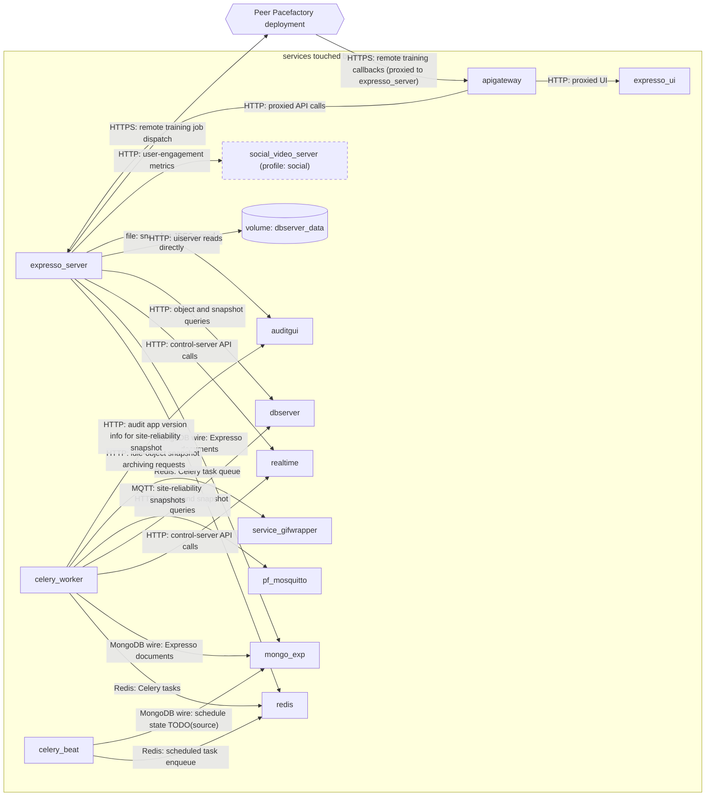

# Profile: `expresso-010`

**Display name:** Expresso profile

The Expresso profile provides expresso_server and the Expresso UI

| Attribute | Value |
|---|---|
| Fragment | `compose/docker-compose.expresso-010.yml` |
| Class | forced (build.sh) |
| Prompt | (default: "Enable Expresso profile?") |
| Parent profile(s) | none |
| Sub-profiles | [`expresso-020-cuda`](expresso-020-cuda.md), [`expresso-030-trainer`](expresso-030-trainer.md) |
| Requires (`required-profiles`) | none |
| Required by | [`ape`](ape.md) |
| Conflicts with (inferred) | none found |

## Services added

| Service | Node ID | Image | Owning repo | Purpose |
|---|---|---|---|---|
| `expresso_server` | `expresso_server` | `pacefactory/expresso_server:${EXPRESSO_SERVER_TAG:-${EXPRESSO_SERVER_TAG_DEFAULT_GPU:-latest}}` | [expresso_server](https://github.com/pacefactory/expresso_server) (internal) | Expresso API server (stations config, training dispatch, APE events integration) |
| `expresso_ui` | `expresso_ui` | `pacefactory/expresso_ui:${EXPRESSO_UI_TAG:-latest}` | [expresso_ui](https://github.com/pacefactory/expresso_ui) (internal) | Expresso web UI served behind the apigateway at /expresso |
| `redis` | `redis` | `redis:8.2.1-alpine` | [redis](https://hub.docker.com/_/redis) (third-party) | Celery broker/result store for Expresso |
| `celery_worker` | `celery_worker` | `pacefactory/expresso_server:${EXPRESSO_SERVER_TAG:-${EXPRESSO_SERVER_TAG_DEFAULT_GPU:-latest}}` | [expresso_server](https://github.com/pacefactory/expresso_server) (internal) | Expresso background worker (periodic publishing, idle-object archiving) |
| `celery_beat` | `celery_beat` | `pacefactory/expresso_server:${EXPRESSO_SERVER_TAG:-${EXPRESSO_SERVER_TAG_DEFAULT_GPU:-latest}}` | [expresso_server](https://github.com/pacefactory/expresso_server) (internal) | Expresso scheduler; singleton |
| `mongo_exp` | `mongo_exp` | `mongodb/mongodb-community-server:8.2.1-ubi8` | [mongodb-community-server](https://hub.docker.com/r/mongodb/mongodb-community-server) (third-party) | MongoDB 8 store for Expresso |

## Services modified from other profiles

| Service | Home profile | Keys this profile adds or overrides |
|---|---|---|
| `auditgui` | [`base`](base.md) | environment |
| `apigateway` | [`base`](base.md) | depends_on, environment |

## Networks and volumes added

- Networks: expresso_network
- Named volumes: expresso-data, mongodata_exp

## Settings (`x-pf-info.settings`)

| Variable | Default (as written) | Hidden | default_var | Description |
|---|---|---|---|---|
| `EXPRESSO_SERVER_TAG` | `latest` | false | `EXPRESSO_SERVER_TAG_DEFAULT_GPU` | (none in fragment) |
| `EXPRESSO_UI_TAG` | `latest` | false |  | (none in fragment) |
| `EXPRESSO_UI_PASSWORD_PROTECTION` | `true` | false |  | Enable Expresso UI password protection (true/false) |
| `PF_IDLE_ARCHIVE_ENABLED` | `true` | false |  | Enable the scheduled idle-object snapshot archiving task (true/false). Per-site kill switch; disabled means the task exits immediately without calling gifwrapper. |
| `PF_EXPRESSO_PUBLIC_URL_BASE` | `""` | false |  | Public URL other deployments use to reach this one for remote-training callbacks, including scheme and the /api/expresso prefix (e.g. https://site.example.com/api/expresso). Leave blank if this deployment will not dispatch training to a remote. |
| `PF_REMOTE_TRAINER_URLS` | `""` | false |  | Optional comma-separated remote Expresso base URLs to pre-register as remote trainers (e.g. https://siteB.example.com/api/expresso,https://siteC.example.com/api/expresso). Leave blank to add them later via the UI/API. |

See the [environment variable reference](../../reference/environment-variables.md) for where each value reaches.

## Inputs / Outputs

Flows this profile originates or terminates. Node IDs are defined in the [glossary](../glossary.md).

| From | To | Direction | Protocol | Port / endpoint / topic / table | Payload | Trigger | Profile | Details |
|---|---|---|---|---|---|---|---|---|
| `expresso_server` | `redis` | internal | Redis | redis (port TODO(source), default 6379) | Celery task queue | on event | expresso-010 | source: `compose/docker-compose.expresso-010.yml:58`; [link](https://github.com/pacefactory/expresso_server/blob/main/docs/architecture/README.md) |
| `expresso_server` | `mongo_exp` | internal | MongoDB wire | mongo_exp:27017 | Expresso documents | on demand | expresso-010 | source: `compose/docker-compose.expresso-010.yml:60`; [link](https://github.com/pacefactory/expresso_server/blob/main/docs/architecture/README.md) |
| `expresso_server` | `realtime` | internal | HTTP | realtime:8181 | control-server API calls | on demand | expresso-010 | source: `compose/docker-compose.expresso-010.yml:61-62`; [link](https://github.com/pacefactory/expresso_server/blob/main/docs/architecture/README.md) |
| `expresso_server` | `dbserver` | internal | HTTP | dbserver:8050 | object and snapshot queries | on demand | expresso-010 | source: `compose/docker-compose.expresso-010.yml:66-67`; [link](https://github.com/pacefactory/expresso_server/blob/main/docs/architecture/README.md) |
| `expresso_server` | `vol_dbserver_data` | internal | file | /home/scv2/dbserver_volume (ro mount of dbserver-data) | snapshot JPEGs read directly | on demand | expresso-010 | source: `compose/docker-compose.expresso-010.yml:47-50,75`; [link](https://github.com/pacefactory/expresso_server/blob/main/docs/architecture/README.md) |
| `expresso_server` | `auditgui` | internal | HTTP | auditgui:80 | uiserver reads | on demand | expresso-010 | source: `compose/docker-compose.expresso-010.yml:59`; [link](https://github.com/pacefactory/expresso_server/blob/main/docs/architecture/README.md) |
| `expresso_server` | `social_video_server` | internal | HTTP | social_video_server:9999 (tolerated unreachable without social) | user-engagement metrics | on demand | expresso-010 | source: `compose/docker-compose.expresso-010.yml:76-80`; [link](https://github.com/pacefactory/expresso_server/blob/main/docs/architecture/README.md) |
| `expresso_server` | `ext_peer_deployment` | out | HTTPS | PF_REMOTE_TRAINER_URLS (<peer>/api/expresso) | remote training job dispatch | on demand | expresso-010 | source: `compose/docker-compose.expresso-010.yml:30-35,89-91`; [link](https://github.com/pacefactory/expresso_server/blob/main/docs/architecture/README.md) |
| `ext_peer_deployment` | `apigateway` | in | HTTPS | PF_EXPRESSO_PUBLIC_URL_BASE/training/remote/callback | remote training callbacks (proxied to expresso_server) | on event | expresso-010 | source: `compose/docker-compose.expresso-010.yml:23-29,84-88`; [link](https://github.com/pacefactory/expresso_server/blob/main/docs/architecture/README.md) |
| `celery_worker` | `redis` | internal | Redis | redis | Celery tasks | on event | expresso-010 | source: `compose/docker-compose.expresso-010.yml:180`; [link](https://github.com/pacefactory/expresso_server/blob/main/docs/architecture/README.md) |
| `celery_worker` | `mongo_exp` | internal | MongoDB wire | mongo_exp:27017 | Expresso documents | on demand | expresso-010 | source: `compose/docker-compose.expresso-010.yml:181`; [link](https://github.com/pacefactory/expresso_server/blob/main/docs/architecture/README.md) |
| `celery_worker` | `realtime` | internal | HTTP | realtime:8181 | control-server API calls | on demand | expresso-010 | source: `compose/docker-compose.expresso-010.yml:182-183`; [link](https://github.com/pacefactory/expresso_server/blob/main/docs/architecture/README.md) |
| `celery_worker` | `dbserver` | internal | HTTP | dbserver:8050 | object and snapshot queries | on demand | expresso-010 | source: `compose/docker-compose.expresso-010.yml:187-188`; [link](https://github.com/pacefactory/expresso_server/blob/main/docs/architecture/README.md) |
| `celery_worker` | `pf_mosquitto` | internal | MQTT | pf_mosquitto:1883 | site-reliability snapshots | polling (celery beat schedule) | expresso-010 | source: `compose/docker-compose.expresso-010.yml:192-195`; [link](https://github.com/pacefactory/expresso_server/blob/main/docs/architecture/README.md) |
| `celery_worker` | `service_gifwrapper` | internal | HTTP | service_gifwrapper:7171 | idle-object snapshot archiving requests | polling (celery beat schedule) | expresso-010 | source: `compose/docker-compose.expresso-010.yml:196-199`; [link](https://github.com/pacefactory/expresso_server/blob/main/docs/architecture/README.md) |
| `celery_worker` | `auditgui` | internal | HTTP | auditgui:80 | audit app version info for site-reliability snapshot | polling | expresso-010 | source: `compose/docker-compose.expresso-010.yml:204-205`; [link](https://github.com/pacefactory/expresso_server/blob/main/docs/architecture/README.md) |
| `celery_beat` | `redis` | internal | Redis | redis | scheduled task enqueue | polling (schedule) | expresso-010 | source: `compose/docker-compose.expresso-010.yml:227`; [link](https://github.com/pacefactory/expresso_server/blob/main/docs/architecture/README.md) |
| `celery_beat` | `mongo_exp` | internal | MongoDB wire | mongo_exp:27017 | schedule state TODO(source) | polling | expresso-010 | source: `compose/docker-compose.expresso-010.yml:228`; [link](https://github.com/pacefactory/expresso_server/blob/main/docs/architecture/README.md) |
| `apigateway` | `expresso_server` | internal | HTTP | expresso_server:8456 (/api/expresso) | proxied API calls | on demand | expresso-010 | source: `compose/docker-compose.expresso-010.yml:253-254`; [link](https://github.com/pacefactory/scv2_apigateway/blob/main/docs/architecture/README.md) |
| `apigateway` | `expresso_ui` | internal | HTTP | expresso_ui:80 (/expresso) | proxied UI | on demand | expresso-010 | source: `compose/docker-compose.expresso-010.yml:255-256`; [link](https://github.com/pacefactory/scv2_apigateway/blob/main/docs/architecture/README.md) |

## Diagram

Source: [`expresso-010.mmd`](expresso-010.mmd). Dashed boxes are services from optional profiles; hexagons are external systems.

