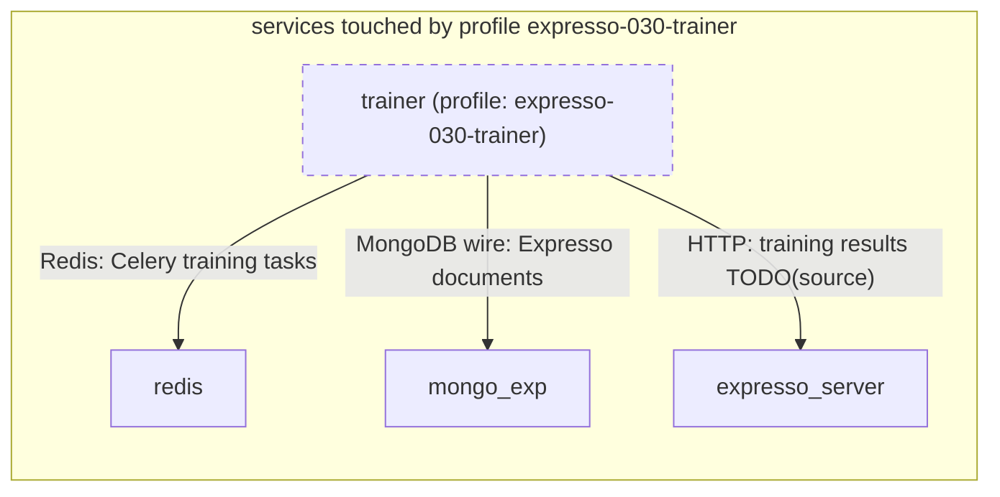

# Profile: `expresso-030-trainer`

**Display name:** Expresso Trainer

Adds a GPU-backed Celery worker that runs model training and synthetic data generation tasks dispatched by expresso_server. Requires an NVIDIA GPU and the nvidia container runtime on the host.

| Attribute | Value |
|---|---|
| Fragment | `compose/docker-compose.expresso-030-trainer.yml` |
| Class | sub-profile of expresso-010, default off |
| Prompt | Enable the Trainer worker for Expresso? |
| Parent profile(s) | [`expresso-010`](expresso-010.md) |
| Sub-profiles | none |
| Requires (`required-profiles`) | none |
| Required by | none |
| Conflicts with (inferred) | none found |

## Services added

| Service | Node ID | Image | Owning repo | Purpose |
|---|---|---|---|---|
| `trainer` | `trainer` | `pacefactory/trainer:${TRAINER_TAG:-latest}` | [trainer](https://github.com/pacefactory/trainer) (internal) | GPU Celery worker for model training and synthetic data generation |

## Services modified from other profiles

None.

## Networks and volumes added

- Networks: none
- Named volumes: none

## Settings (`x-pf-info.settings`)

| Variable | Default (as written) | Hidden | default_var | Description |
|---|---|---|---|---|
| `TRAINER_TAG` | `latest` | false |  | (none in fragment) |
| `TRAINER_SHM_SIZE` | `2gb` | false |  | Shared memory (/dev/shm) size for the trainer container. Increase if PyTorch DataLoader deadlocks (e.g. 4gb, 8gb). |

See the [environment variable reference](../../reference/environment-variables.md) for where each value reaches.

## Inputs / Outputs

Flows this profile originates or terminates. Node IDs are defined in the [glossary](../glossary.md).

| From | To | Direction | Protocol | Port / endpoint / topic / table | Payload | Trigger | Profile | Details |
|---|---|---|---|---|---|---|---|---|
| `trainer` | `redis` | internal | Redis | redis | Celery training tasks | on event | expresso-030-trainer | source: `compose/docker-compose.expresso-030-trainer.yml:29`; [link](https://github.com/pacefactory/trainer/blob/main/docs/architecture/README.md) |
| `trainer` | `mongo_exp` | internal | MongoDB wire | mongo_exp:27017 | Expresso documents | on demand | expresso-030-trainer | source: `compose/docker-compose.expresso-030-trainer.yml:30`; [link](https://github.com/pacefactory/trainer/blob/main/docs/architecture/README.md) |
| `trainer` | `expresso_server` | internal | HTTP | expresso_server (port TODO(source), 8456 expected) | training results TODO(source) | on event | expresso-030-trainer | source: `compose/docker-compose.expresso-030-trainer.yml:32`; [link](https://github.com/pacefactory/trainer/blob/main/docs/architecture/README.md) |

## Diagram

Source: [`expresso-030-trainer.mmd`](expresso-030-trainer.mmd). Dashed boxes are services from optional profiles; hexagons are external systems.

