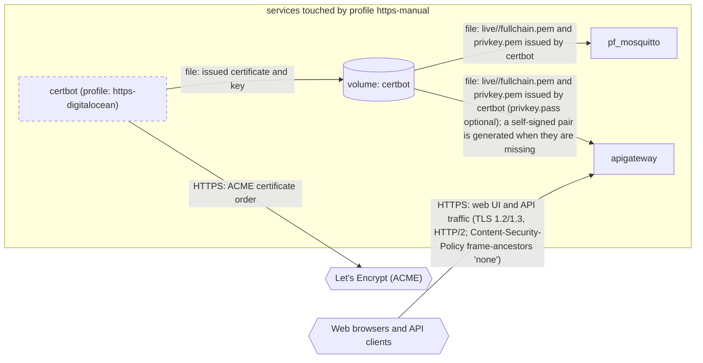

# Profile: `https-manual`

**Display name:** HTTPS (Manual)

Manually provision HTTPS certificate via letsencrypt. Clients that connect over plain HTTP are redirected to HTTPS. The mqtts-public sub-profile (default-enabled) reuses the cert to expose MQTTS on port 8883.

| Attribute | Value |
|---|---|
| Fragment | `compose/docker-compose.https-manual.yml` |
| Class | prompted, default off |
| Prompt | Enable HTTPS (via manual DNS) |
| Parent profile(s) | none |
| Sub-profiles | [`mqtts-public`](mqtts-public.md) |
| Requires (`required-profiles`) | none |
| Required by | none |
| Conflicts with (inferred) | `https-digitalocean` (same container name certbot; same host port 443) `https-godaddy` (same container name certbot; same host port 443) `https-no-certbot` (same host port 443) |

## Services added

| Service | Node ID | Image | Owning repo | Purpose |
|---|---|---|---|---|
| `certbot` | `certbot` | `certbot/certbot` | [certbot](https://hub.docker.com/r/certbot/certbot) (third-party) | On-demand Let's Encrypt client (image varies by https-* profile) |

## Services modified from other profiles

| Service | Home profile | Keys this profile adds or overrides |
|---|---|---|
| `apigateway` | [`base`](base.md) | ports, volumes, environment |

## Networks and volumes added

- Networks: none
- Named volumes: certbot

## Settings (`x-pf-info.settings`)

| Variable | Default (as written) | Hidden | default_var | Description |
|---|---|---|---|---|
| `SERVER_NAME` | `""` | false |  | Final domain name will be SERVER_NAME |
| `LETSENCRYPT_EMAIL` | `""` | false |  | Email address to use for letsencrypt.com |
| `HTTPS_PORT` | `443` | false |  | (none in fragment) |
| `MQTTS_CERT_SOURCE` | `certbot` | true |  | (none in fragment) |

See the [environment variable reference](../../reference/environment-variables.md) for where each value reaches.

## Inputs / Outputs

Flows this profile originates or terminates. Node IDs are defined in the [glossary](../glossary.md).

| From | To | Direction | Protocol | Port / endpoint / topic / table | Payload | Trigger | Profile | Details |
|---|---|---|---|---|---|---|---|---|
| `certbot` | `ext_acme` | out | HTTPS | acme-v02.api.letsencrypt.org TODO(source); manual DNS challenge | ACME certificate order | on demand | https-manual | source: `compose/docker-compose.https-manual.yml:29-41`; [link](https://eff-certbot.readthedocs.io/) |
| `certbot` | `vol_certbot` | internal | file | /etc/letsencrypt | issued certificate and key | on demand | https-manual | source: `compose/docker-compose.https-manual.yml:45,51`; [link](https://eff-certbot.readthedocs.io/) |
| `vol_certbot` | `pf_mosquitto` | internal | file | /etc/mosquitto-tls (ro mount of the certbot volume, MQTTS_CERT_SOURCE=certbot) | live/<SERVER_NAME>/fullchain.pem and privkey.pem issued by certbot | on demand (container start) | https-manual | source: `compose/docker-compose.https-manual.yml:19-20; compose/docker-compose.mqtts-public.yml:21-22`; [link](https://github.com/pacefactory/pf_mosquitto/blob/master/docs/reference/configuration.md) |
| `vol_certbot` | `apigateway` | internal | file | /etc/nginx/ssl (ro mount of the certbot volume) | live/<SERVER_NAME>/fullchain.pem and privkey.pem issued by certbot (privkey.pass optional); a self-signed pair is generated when they are missing | on demand (container start) | https-manual | source: `compose/docker-compose.https-manual.yml:50-51`; [link](https://github.com/pacefactory/scv2_apigateway/blob/master/docs/reference/configuration.md#ssl-profile) |
| `ext_web_clients` | `apigateway` | in | HTTPS | host port HTTPS_PORT (default 443) | web UI and API traffic (TLS 1.2/1.3, HTTP/2; Content-Security-Policy frame-ancestors 'none') | on demand | https-manual | source: `compose/docker-compose.https-manual.yml:48-49`; [link](https://github.com/pacefactory/scv2_apigateway/blob/master/docs/reference/api.md#listeners) |

## Diagram

Source: [`https-manual.mmd`](https-manual.mmd). Dashed boxes are services from optional profiles; hexagons are external systems.

