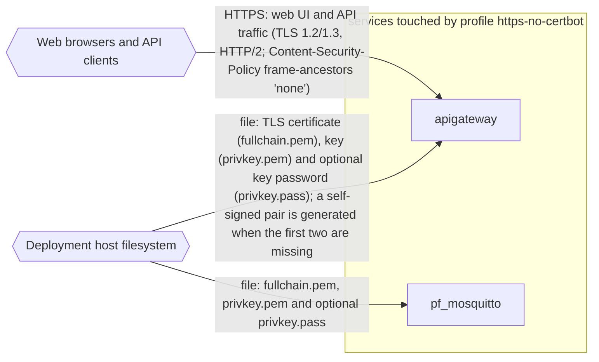

# Profile: `https-no-certbot`

**Display name:** HTTPS (manual, no certbot)

Use existing HTTPS certificate. No provisioning via certbot. The certificate and key are read from ./credentials/ssl/live/${SERVER_NAME}/fullchain.pem and ./credentials/ssl/live/${SERVER_NAME}/privkey.pem (the paths used by the automated certificate install and scripts/import-ssl-cert.sh). If privkey.pem is encrypted, the password must be specified in ./credentials/ssl/live/${SERVER_NAME}/privkey.pass on a single line. If the certificate and key do not exist yet, the apigateway serves a temporary self-signed certificate until they are installed and the deployment is restarted (./update.sh). Clients that connect over plain HTTP are redirected to HTTPS. The mqtts-public sub-profile (default-enabled) reuses these certs to expose MQTTS on port 8883.

| Attribute | Value |
|---|---|
| Fragment | `compose/docker-compose.https-no-certbot.yml` |
| Class | prompted, default off |
| Prompt | Enable HTTPS (via direct SSL) |
| Parent profile(s) | none |
| Sub-profiles | [`mqtts-public`](mqtts-public.md) |
| Requires (`required-profiles`) | none |
| Required by | none |
| Conflicts with (inferred) | `https-digitalocean` (same host port 443) `https-godaddy` (same host port 443) `https-manual` (same host port 443) |

## Services added

None. This profile only modifies services from other profiles.

## Services modified from other profiles

| Service | Home profile | Keys this profile adds or overrides |
|---|---|---|
| `apigateway` | [`base`](base.md) | ports, volumes, environment |

## Networks and volumes added

- Networks: none
- Named volumes: none

## Settings (`x-pf-info.settings`)

| Variable | Default (as written) | Hidden | default_var | Description |
|---|---|---|---|---|
| `SERVER_NAME` | `""` | false |  | Final domain name will be SERVER_NAME |
| `HTTPS_PORT` | `443` | false |  | (none in fragment) |
| `MQTTS_CERT_SOURCE` | `../credentials/ssl` | true |  | (none in fragment) |

See the [environment variable reference](../../reference/environment-variables.md) for where each value reaches.

## Inputs / Outputs

Flows this profile originates or terminates. Node IDs are defined in the [glossary](../glossary.md).

| From | To | Direction | Protocol | Port / endpoint / topic / table | Payload | Trigger | Profile | Details |
|---|---|---|---|---|---|---|---|---|
| `ext_host_fs` | `apigateway` | in | file | credentials/ssl/live/<SERVER_NAME>/ mounted at /etc/nginx/ssl (ro) | TLS certificate (fullchain.pem), key (privkey.pem) and optional key password (privkey.pass); a self-signed pair is generated when the first two are missing | on demand (container start) | https-no-certbot | source: `compose/docker-compose.https-no-certbot.yml:32-33`; [link](https://github.com/pacefactory/scv2_apigateway/blob/master/docs/reference/configuration.md#ssl-profile) |
| `ext_host_fs` | `pf_mosquitto` | in | file | credentials/ssl/live/<SERVER_NAME>/ (MQTTS_CERT_SOURCE=../credentials/ssl) mounted at /etc/mosquitto-tls (ro) | fullchain.pem, privkey.pem and optional privkey.pass | on demand (container start) | https-no-certbot | source: `compose/docker-compose.https-no-certbot.yml:24-25; compose/docker-compose.mqtts-public.yml:21-22`; [link](https://github.com/pacefactory/pf_mosquitto/blob/master/docs/reference/configuration.md) |
| `ext_web_clients` | `apigateway` | in | HTTPS | host port HTTPS_PORT (default 443) | web UI and API traffic (TLS 1.2/1.3, HTTP/2; Content-Security-Policy frame-ancestors 'none') | on demand | https-no-certbot | source: `compose/docker-compose.https-no-certbot.yml:30-31`; [link](https://github.com/pacefactory/scv2_apigateway/blob/master/docs/reference/api.md#listeners) |

## Diagram

Source: [`https-no-certbot.mmd`](https-no-certbot.mmd). Dashed boxes are services from optional profiles; hexagons are external systems.

