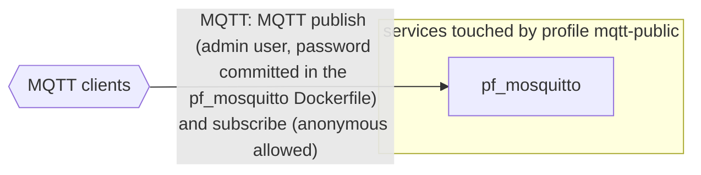

# Profile: `mqtt-public`

**Display name:** Public MQTT (port 1883)

Exposes the pf_mosquitto broker's plain MQTT listener on the host. Default-enabled. Disable on deployments where 1883 should not be publicly reachable (e.g. internet-facing sites that prefer MQTTS only). HTTPS-enabled deployments can additionally serve MQTTS on port 8883 via the mqtts-public sub-profile of any https-* profile.

| Attribute | Value |
|---|---|
| Fragment | `compose/docker-compose.mqtt-public.yml` |
| Class | sub-profile of base, default on |
| Prompt | Expose plain MQTT on port 1883? |
| Parent profile(s) | [`base`](base.md) |
| Sub-profiles | none |
| Requires (`required-profiles`) | none |
| Required by | none |
| Conflicts with (inferred) | none found |

## Services added

None. This profile only modifies services from other profiles.

## Services modified from other profiles

| Service | Home profile | Keys this profile adds or overrides |
|---|---|---|
| `pf_mosquitto` | [`base`](base.md) | ports |

## Networks and volumes added

- Networks: none
- Named volumes: none

## Settings (`x-pf-info.settings`)

| Variable | Default (as written) | Hidden | default_var | Description |
|---|---|---|---|---|
| `PF_MOSQUITTO_PUBLIC_PORT` | `1883` | false |  | (none in fragment) |

See the [environment variable reference](../../reference/environment-variables.md) for where each value reaches.

## Inputs / Outputs

Flows this profile originates or terminates. Node IDs are defined in the [glossary](../glossary.md).

| From | To | Direction | Protocol | Port / endpoint / topic / table | Payload | Trigger | Profile | Details |
|---|---|---|---|---|---|---|---|---|
| `ext_mqtt_clients` | `pf_mosquitto` | in | MQTT | host port PF_MOSQUITTO_PUBLIC_PORT (default 1883) | MQTT publish (admin user, password committed in the pf_mosquitto Dockerfile) and subscribe (anonymous allowed) | continuous | mqtt-public | source: `compose/docker-compose.mqtt-public.yml:16-18`; [link](https://github.com/pacefactory/pf_mosquitto/blob/master/docs/architecture/README.md) |

## Diagram

Source: [`mqtt-public.mmd`](mqtt-public.mmd). Dashed boxes are services from optional profiles; hexagons are external systems.

