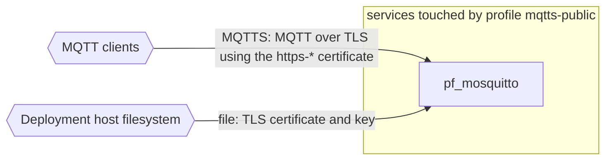

# Profile: `mqtts-public`

**Display name:** Public MQTTS (port 8883)

Mounts the SSL cert dir from the active https-* profile into pf_mosquitto, passes SERVER_NAME, and publishes the MQTTS listener (port 8883) to the host. Default-enabled whenever an https-* profile is active. Disable to keep TLS internal-only (or to use HTTPS for the web UI without exposing native MQTTS to the public). Requires a parent https-* profile to set MQTTS_CERT_SOURCE.

| Attribute | Value |
|---|---|
| Fragment | `compose/docker-compose.mqtts-public.yml` |
| Class | sub-profile of https-digitalocean, https-godaddy, https-manual, https-no-certbot, default on |
| Prompt | Expose MQTTS on port 8883? |
| Parent profile(s) | [`https-digitalocean`](https-digitalocean.md), [`https-godaddy`](https-godaddy.md), [`https-manual`](https-manual.md), [`https-no-certbot`](https-no-certbot.md) |
| Sub-profiles | none |
| Requires (`required-profiles`) | none |
| Required by | none |
| Conflicts with (inferred) | none found |

## Services added

None. This profile only modifies services from other profiles.

## Services modified from other profiles

| Service | Home profile | Keys this profile adds or overrides |
|---|---|---|
| `pf_mosquitto` | [`base`](base.md) | ports, volumes, environment |

## Networks and volumes added

- Networks: none
- Named volumes: none

## Settings (`x-pf-info.settings`)

| Variable | Default (as written) | Hidden | default_var | Description |
|---|---|---|---|---|
| `MQTTS_PUBLIC_PORT` | `8883` | false |  | Public host port for MQTTS. Set blank to keep listener internal. |

See the [environment variable reference](../../reference/environment-variables.md) for where each value reaches.

## Inputs / Outputs

Flows this profile originates or terminates. Node IDs are defined in the [glossary](../glossary.md).

| From | To | Direction | Protocol | Port / endpoint / topic / table | Payload | Trigger | Profile | Details |
|---|---|---|---|---|---|---|---|---|
| `ext_mqtt_clients` | `pf_mosquitto` | in | MQTTS | host port MQTTS_PUBLIC_PORT (default 8883) | MQTT over TLS using the https-* certificate | continuous | mqtts-public | source: `compose/docker-compose.mqtts-public.yml:18-24`; [link](https://github.com/pacefactory/pf_mosquitto/blob/main/docs/architecture/README.md) |
| `ext_host_fs` | `pf_mosquitto` | in | file | MQTTS_CERT_SOURCE mounted at /etc/mosquitto-tls (ro) | TLS certificate and key | on demand (container start) | mqtts-public | source: `compose/docker-compose.mqtts-public.yml:21-22`; [link](https://github.com/pacefactory/pf_mosquitto/blob/main/docs/architecture/README.md) |

## Diagram

Source: [`mqtts-public.mmd`](mqtts-public.mmd). Dashed boxes are services from optional profiles; hexagons are external systems.

