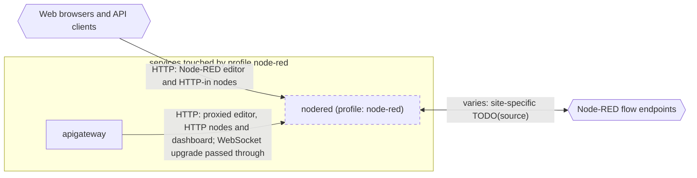

# Profile: `node-red`

**Display name:** node-red profile

The node-red profile enables the node-red service

| Attribute | Value |
|---|---|
| Fragment | `compose/docker-compose.node-red.yml` |
| Class | prompted, default on |
| Prompt | Enable the node-red profile? |
| Parent profile(s) | none |
| Sub-profiles | none |
| Requires (`required-profiles`) | none |
| Required by | none |
| Conflicts with (inferred) | none found |

## Services added

| Service | Node ID | Image | Owning repo | Purpose |
|---|---|---|---|---|
| `nodered` | `nodered` | `nodered/node-red:${NODERED_TAG:-4.0.5-22}` | [node-red](https://hub.docker.com/r/nodered/node-red) (third-party) | Node-RED flow engine for site-specific integrations |

## Services modified from other profiles

| Service | Home profile | Keys this profile adds or overrides |
|---|---|---|
| `apigateway` | [`base`](base.md) | depends_on, environment |

## Networks and volumes added

- Networks: none
- Named volumes: nodered-data

## Settings (`x-pf-info.settings`)

| Variable | Default (as written) | Hidden | default_var | Description |
|---|---|---|---|---|
| `NODERED_TAG` | `4.0.5-22` | false |  | (none in fragment) |
| `NODERED_PORT` | `1880` | false |  | (none in fragment) |
| `NODERED_SITE_NAME` | `site-name` | false |  | (none in fragment) |

See the [environment variable reference](../../reference/environment-variables.md) for where each value reaches.

## Inputs / Outputs

Flows this profile originates or terminates. Node IDs are defined in the [glossary](../glossary.md).

| From | To | Direction | Protocol | Port / endpoint / topic / table | Payload | Trigger | Profile | Details |
|---|---|---|---|---|---|---|---|---|
| `ext_web_clients` | `nodered` | in | HTTP | host port NODERED_PORT (default 1880) | Node-RED editor and HTTP-in nodes | on demand | node-red | source: `compose/docker-compose.node-red.yml:23-24`; [link](https://nodered.org/docs/) |
| `apigateway` | `nodered` | internal | HTTP | nodered:1880 (/api/nodered/, /dashboard/) | proxied editor, HTTP nodes and dashboard; WebSocket upgrade passed through | on demand | node-red | source: `compose/docker-compose.node-red.yml:35-36`; [link](https://github.com/pacefactory/scv2_apigateway/blob/master/docs/reference/api.md) |
| `nodered` | `ext_nodered_endpoints` | bidi | varies | configured per site in flows | site-specific TODO(source) | varies | node-red | source: `compose/docker-compose.node-red.yml (no endpoints in compose)`; [link](https://nodered.org/docs/) |

## Diagram

Source: [`node-red.mmd`](node-red.mmd). Dashed boxes are services from optional profiles; hexagons are external systems.

