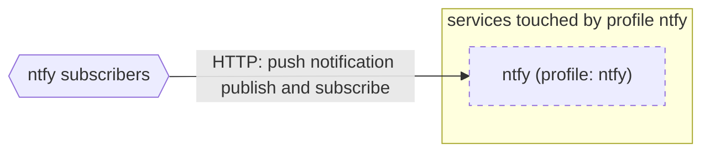

# Profile: `ntfy`

**Display name:** ntfy profile

The ntfy profile enables the ntfy push notification service

| Attribute | Value |
|---|---|
| Fragment | `compose/docker-compose.ntfy.yml` |
| Class | prompted, default off |
| Prompt | Enable the ntfy profile? |
| Parent profile(s) | none |
| Sub-profiles | none |
| Requires (`required-profiles`) | none |
| Required by | none |
| Conflicts with (inferred) | none found |

## Services added

| Service | Node ID | Image | Owning repo | Purpose |
|---|---|---|---|---|
| `ntfy` | `ntfy` | `binwiederhier/ntfy:${NTFY_TAG:-v2.11.0}` | [ntfy](https://hub.docker.com/r/binwiederhier/ntfy) (third-party) | Push notification server |

## Services modified from other profiles

None.

## Networks and volumes added

- Networks: none
- Named volumes: ntfy-cache, ntfy-data

## Settings (`x-pf-info.settings`)

| Variable | Default (as written) | Hidden | default_var | Description |
|---|---|---|---|---|
| `NTFY_TAG` | `v2.11.0` | false |  | (none in fragment) |
| `NTFY_PUBLIC_PORT` | `333` | false |  | (none in fragment) |

See the [environment variable reference](../../reference/environment-variables.md) for where each value reaches.

## Inputs / Outputs

Flows this profile originates or terminates. Node IDs are defined in the [glossary](../glossary.md).

| From | To | Direction | Protocol | Port / endpoint / topic / table | Payload | Trigger | Profile | Details |
|---|---|---|---|---|---|---|---|---|
| `ext_ntfy_clients` | `ntfy` | in | HTTP | host port NTFY_PUBLIC_PORT (default 333) | push notification publish and subscribe | on event | ntfy | source: `compose/docker-compose.ntfy.yml:24-25`; [link](https://docs.ntfy.sh/) |

## Diagram

Source: [`ntfy.mmd`](ntfy.mmd). Dashed boxes are services from optional profiles; hexagons are external systems.

