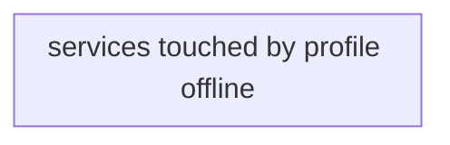

# Profile: `offline`

**Display name:** OFFLINE MODE

The default mode is ONLINE. It is to be used for client sites where the autodelete feature must be enabled to manage storage constraints. OFFLINE MODE is to be used when running videos using the Offline Processing tool. This disabled the autodelete feature, so data persists in the dbserver.

| Attribute | Value |
|---|---|
| Fragment | `compose/docker-compose.offline.yml` |
| Class | prompted, default off |
| Prompt | Enable OFFLINE MODE, only for when running videos using the "Offline Processing"? |
| Parent profile(s) | none |
| Sub-profiles | none |
| Requires (`required-profiles`) | none |
| Required by | none |
| Conflicts with (inferred) | none found |

## Services added

None. This profile only modifies services from other profiles.

## Services modified from other profiles

| Service | Home profile | Keys this profile adds or overrides |
|---|---|---|
| `dbserver` | [`base`](base.md) | environment |
| `service_audit_processing` | [`base`](base.md) | environment |

## Networks and volumes added

- Networks: none
- Named volumes: none

## Settings (`x-pf-info.settings`)

None.

## Inputs / Outputs

Flows this profile originates or terminates. Node IDs are defined in the [glossary](../glossary.md).

None. This profile changes configuration only; it adds no flow of its own.

## Diagram

Source: [`offline.mmd`](offline.mmd). Dashed boxes are services from optional profiles; hexagons are external systems.

