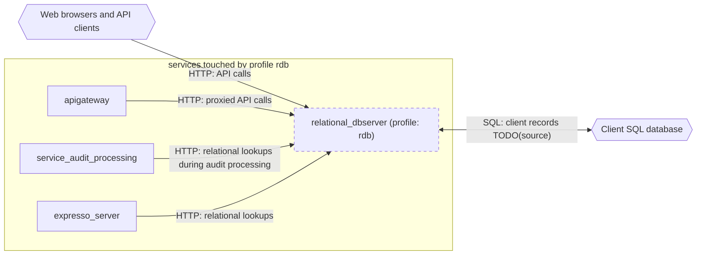

# Profile: `rdb`

**Display name:** relational dbserver profile

The relational dbserver profile enables the relational_dbserver service, which allows integrations between the webgui and a client's existing SQL database. (relational_dbserver)

| Attribute | Value |
|---|---|
| Fragment | `compose/docker-compose.rdb.yml` |
| Class | prompted, default on |
| Prompt | Enable the relational dbserver profile? |
| Parent profile(s) | none |
| Sub-profiles | none |
| Requires (`required-profiles`) | none |
| Required by | [`ape`](ape.md) |
| Conflicts with (inferred) | none found |

## Services added

| Service | Node ID | Image | Owning repo | Purpose |
|---|---|---|---|---|
| `relational_dbserver` | `relational_dbserver` | `pacefactory/relational-dbserver:${RDB_TAG:-latest}` | [relational-dbserver](https://github.com/pacefactory/relational-dbserver) (inferred) | Bridge between the deployment and a client's existing SQL database |

## Services modified from other profiles

| Service | Home profile | Keys this profile adds or overrides |
|---|---|---|
| `apigateway` | [`base`](base.md) | depends_on, environment |
| `auditgui` | [`base`](base.md) | environment |
| `service_audit_processing` | [`base`](base.md) | environment |
| `expresso_server` | [`expresso-010`](expresso-010.md) | environment |

## Networks and volumes added

- Networks: none
- Named volumes: relational_dbserver-data

## Settings (`x-pf-info.settings`)

| Variable | Default (as written) | Hidden | default_var | Description |
|---|---|---|---|---|
| `RDB_TAG` | `latest` | false |  | (none in fragment) |
| `RDB_PUBLIC_PORT` | `8282` | false |  | (none in fragment) |

See the [environment variable reference](../../reference/environment-variables.md) for where each value reaches.

## Inputs / Outputs

Flows this profile originates or terminates. Node IDs are defined in the [glossary](../glossary.md).

| From | To | Direction | Protocol | Port / endpoint / topic / table | Payload | Trigger | Profile | Details |
|---|---|---|---|---|---|---|---|---|
| `relational_dbserver` | `ext_client_sql` | bidi | SQL | client database host and driver TODO(source) | client records TODO(source) | on demand | rdb | source: `compose/docker-compose.rdb.yml:5-7`; [link](https://github.com/pacefactory/relational-dbserver/blob/main/docs/architecture/README.md) |
| `ext_web_clients` | `relational_dbserver` | in | HTTP | host port RDB_PUBLIC_PORT (default 8282) | API calls | on demand | rdb | source: `compose/docker-compose.rdb.yml:22-23`; [link](https://github.com/pacefactory/relational-dbserver/blob/main/docs/architecture/README.md) |
| `apigateway` | `relational_dbserver` | internal | HTTP | relational_dbserver:8282 (/api/rdb) | proxied API calls | on demand | rdb | source: `compose/docker-compose.rdb.yml:34-35`; [link](https://github.com/pacefactory/scv2_apigateway/blob/main/docs/architecture/README.md) |
| `service_audit_processing` | `relational_dbserver` | internal | HTTP | relational_dbserver:8282 | relational lookups during audit processing | on demand | rdb | source: `compose/docker-compose.rdb.yml:43`; [link](https://github.com/pacefactory/scv3_services_processing/blob/main/docs/architecture/README.md) |
| `expresso_server` | `relational_dbserver` | internal | HTTP | relational_dbserver:8282 | relational lookups | on demand | rdb | source: `compose/docker-compose.rdb.yml:47`; [link](https://github.com/pacefactory/expresso_server/blob/main/docs/architecture/README.md) |

## Diagram

Source: [`rdb.mmd`](rdb.mmd). Dashed boxes are services from optional profiles; hexagons are external systems.

