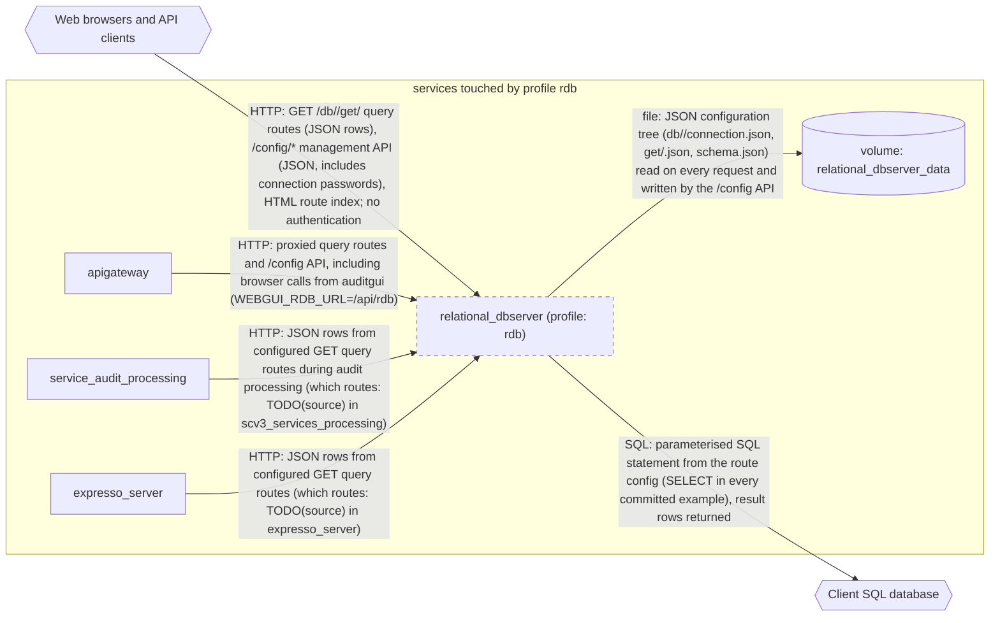

# Profile: `rdb`

**Display name:** relational dbserver profile

The relational dbserver profile enables the relational_dbserver service, which allows integrations between the webgui and a client's existing SQL database. (relational_dbserver)

| Attribute | Value |
|---|---|
| Fragment | `compose/docker-compose.rdb.yml` |
| Class | prompted, default on |
| Prompt | Enable the relational dbserver profile? |
| Parent profile(s) | none |
| Sub-profiles | none |
| Requires (`required-profiles`) | none |
| Required by | [`ape`](ape.md) |
| Conflicts with (inferred) | none found |

## Services added

| Service | Node ID | Image | Owning repo | Purpose |
|---|---|---|---|---|
| `relational_dbserver` | `relational_dbserver` | `pacefactory/relational-dbserver:${RDB_TAG:-latest}` | [scv2_relational_dbserver](https://github.com/pacefactory/scv2_relational_dbserver) (internal) | Express HTTP API that runs SQL queries defined in JSON config files against a client's SQL Server or PostgreSQL database (TypeORM) and returns the rows |

## Services modified from other profiles

| Service | Home profile | Keys this profile adds or overrides |
|---|---|---|
| `apigateway` | [`base`](base.md) | depends_on, environment |
| `auditgui` | [`base`](base.md) | environment |
| `service_audit_processing` | [`base`](base.md) | environment |
| `expresso_server` | [`expresso-010`](expresso-010.md) | environment |

## Networks and volumes added

- Networks: none
- Named volumes: relational_dbserver-data

## Settings (`x-pf-info.settings`)

| Variable | Default (as written) | Hidden | default_var | Description |
|---|---|---|---|---|
| `RDB_TAG` | `latest` | false |  | (none in fragment) |
| `RDB_PUBLIC_PORT` | `8282` | false |  | (none in fragment) |

See the [environment variable reference](../../reference/environment-variables.md) for where each value reaches.

## Inputs / Outputs

Flows this profile originates or terminates. Node IDs are defined in the [glossary](../glossary.md).

| From | To | Direction | Protocol | Port / endpoint / topic / table | Payload | Trigger | Profile | Details |
|---|---|---|---|---|---|---|---|---|
| `relational_dbserver` | `ext_client_sql` | out | SQL | host and port from db/<database>/connection.json on the relational_dbserver volume; TypeORM type mssql (TDS, example port 1433) or postgres (PostgreSQL wire, example port 5432); connection opened by relational_dbserver on first use | parameterised SQL statement from the route config (SELECT in every committed example), result rows returned | on demand | rdb | source: `compose/docker-compose.rdb.yml:5-7; scv2_relational_dbserver src/services/db/connection-manager-subclass.ts, package.json:127-128`; [link](https://github.com/pacefactory/scv2_relational_dbserver/blob/main/docs/reference/schemas/connection-config.md) |
| `relational_dbserver` | `vol_relational_dbserver_data` | internal | file | /home/scv2/volume (rw mount of relational_dbserver-data); config tree at config/rdbserver-config/ | JSON configuration tree (db/<database>/connection.json, get/<route>.json, schema.json) read on every request and written by the /config API | on demand | rdb | source: `compose/docker-compose.rdb.yml:24-25,49-50; scv2_relational_dbserver docker/Dockerfile:31`; [link](https://github.com/pacefactory/scv2_relational_dbserver/blob/main/docs/reference/schemas/config-tree.md) |
| `ext_web_clients` | `relational_dbserver` | in | HTTP | host port RDB_PUBLIC_PORT (default 8282) | GET /db/<database>/get/<route> query routes (JSON rows), /config/* management API (JSON, includes connection passwords), HTML route index; no authentication | on demand | rdb | source: `compose/docker-compose.rdb.yml:22-23`; [link](https://github.com/pacefactory/scv2_relational_dbserver/blob/main/docs/reference/api.md) |
| `apigateway` | `relational_dbserver` | internal | HTTP | relational_dbserver:8282 (/api/rdb/ on the gateway, served at / by the service) | proxied query routes and /config API, including browser calls from auditgui (WEBGUI_RDB_URL=/api/rdb) | on demand | rdb | source: `compose/docker-compose.rdb.yml:29-39`; [link](https://github.com/pacefactory/scv2_relational_dbserver/blob/main/docs/reference/api.md) |
| `service_audit_processing` | `relational_dbserver` | internal | HTTP | relational_dbserver:8282 (/db/<database>/get/<route>) | JSON rows from configured GET query routes during audit processing (which routes: TODO(source) in scv3_services_processing) | on demand | rdb | source: `compose/docker-compose.rdb.yml:41-43`; [link](https://github.com/pacefactory/scv2_relational_dbserver/blob/main/docs/reference/api.md) |
| `expresso_server` | `relational_dbserver` | internal | HTTP | relational_dbserver:8282 (/db/<database>/get/<route>) | JSON rows from configured GET query routes (which routes: TODO(source) in expresso_server) | on demand | rdb | source: `compose/docker-compose.rdb.yml:45-47`; [link](https://github.com/pacefactory/scv2_relational_dbserver/blob/main/docs/reference/api.md) |

## Diagram

Source: [`rdb.mmd`](rdb.mmd). Dashed boxes are services from optional profiles; hexagons are external systems.

