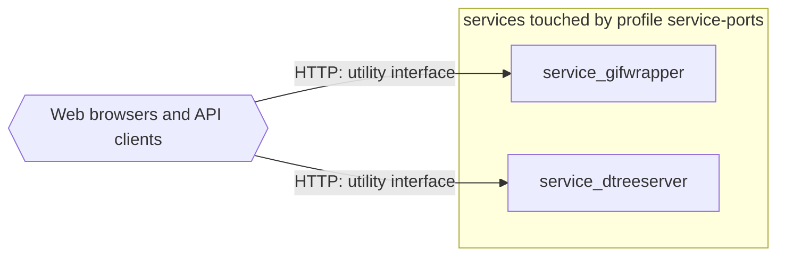

# Profile: `service-ports`

**Display name:** Service Ports

These are not strictly necessary, but make management easier. In a security constrained environment open ports can be disabled.

| Attribute | Value |
|---|---|
| Fragment | `compose/docker-compose.service-ports.yml` |
| Class | prompted, default off |
| Prompt | Enable per-service ports for accessing dtree and gifwrapper utility interfaces? |
| Parent profile(s) | none |
| Sub-profiles | none |
| Requires (`required-profiles`) | none |
| Required by | none |
| Conflicts with (inferred) | none found |

## Services added

None. This profile only modifies services from other profiles.

## Services modified from other profiles

| Service | Home profile | Keys this profile adds or overrides |
|---|---|---|
| `service_gifwrapper` | [`base`](base.md) | ports |
| `service_dtreeserver` | [`base`](base.md) | ports |

## Networks and volumes added

- Networks: none
- Named volumes: none

## Settings (`x-pf-info.settings`)

| Variable | Default (as written) | Hidden | default_var | Description |
|---|---|---|---|---|
| `DTREESERVER_PUBLIC_PORT` | `7272` | false |  | (none in fragment) |
| `GIFWRAPPER_PUBLIC_PORT` | `7171` | false |  | (none in fragment) |

See the [environment variable reference](../../reference/environment-variables.md) for where each value reaches.

## Inputs / Outputs

Flows this profile originates or terminates. Node IDs are defined in the [glossary](../glossary.md).

| From | To | Direction | Protocol | Port / endpoint / topic / table | Payload | Trigger | Profile | Details |
|---|---|---|---|---|---|---|---|---|
| `ext_web_clients` | `service_gifwrapper` | in | HTTP | host port GIFWRAPPER_PUBLIC_PORT (default 7171) | utility interface | on demand | service-ports | source: `compose/docker-compose.service-ports.yml:14-16`; [link](https://github.com/pacefactory/scv2_services_gifwrapper/blob/main/docs/architecture/README.md) |
| `ext_web_clients` | `service_dtreeserver` | in | HTTP | host port DTREESERVER_PUBLIC_PORT (default 7272) | utility interface | on demand | service-ports | source: `compose/docker-compose.service-ports.yml:17-19`; [link](https://github.com/pacefactory/scv2_services_dtreeserver/blob/main/docs/architecture/README.md) |

## Diagram

Source: [`service-ports.mmd`](service-ports.mmd). Dashed boxes are services from optional profiles; hexagons are external systems.

