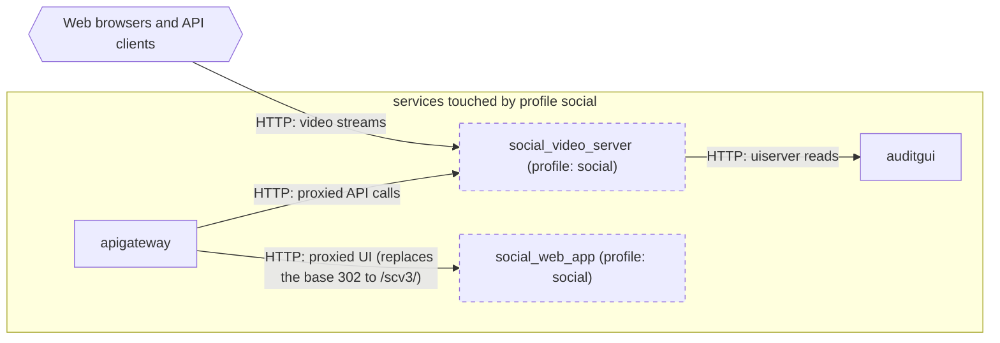

# Profile: `social`

**Display name:** social profile

The social profile enables the video-based social media web app and video server (social_web_app, social_video_server)"

| Attribute | Value |
|---|---|
| Fragment | `compose/docker-compose.social.yml` |
| Class | prompted, default on |
| Prompt | Enable the social profile? |
| Parent profile(s) | none |
| Sub-profiles | none |
| Requires (`required-profiles`) | none |
| Required by | none |
| Conflicts with (inferred) | none found |

## Services added

| Service | Node ID | Image | Owning repo | Purpose |
|---|---|---|---|---|
| `social_web_app` | `social_web_app` | `pacefactory/social_web_app:${SOCIAL_WEB_APP_TAG:-latest}` | [social_web_app](https://github.com/pacefactory/social_web_app) (internal) | Video-based social web app served behind the apigateway |
| `social_video_server` | `social_video_server` | `pacefactory/social_video_server:${SOCIAL_VIDEO_SERVER_TAG:-latest}` | [social_video_server](https://github.com/pacefactory/social_video_server) (internal) | Video server for the social web app |

## Services modified from other profiles

| Service | Home profile | Keys this profile adds or overrides |
|---|---|---|
| `apigateway` | [`base`](base.md) | depends_on, environment |

## Networks and volumes added

- Networks: none
- Named volumes: social_video_server-data

## Settings (`x-pf-info.settings`)

| Variable | Default (as written) | Hidden | default_var | Description |
|---|---|---|---|---|
| `SOCIAL_WEB_APP_TAG` | `latest` | false |  | (none in fragment) |
| `SOCIAL_VIDEO_SERVER_TAG` | `latest` | false |  | (none in fragment) |
| `SOCIAL_VIDEO_PUBLIC_PORT` | `9999` | false |  | (none in fragment) |

See the [environment variable reference](../../reference/environment-variables.md) for where each value reaches.

## Inputs / Outputs

Flows this profile originates or terminates. Node IDs are defined in the [glossary](../glossary.md).

| From | To | Direction | Protocol | Port / endpoint / topic / table | Payload | Trigger | Profile | Details |
|---|---|---|---|---|---|---|---|---|
| `social_video_server` | `auditgui` | internal | HTTP | auditgui:80 | uiserver reads | on demand | social | source: `compose/docker-compose.social.yml:42`; [link](https://github.com/pacefactory/social_video_server/blob/main/docs/architecture/README.md) |
| `ext_web_clients` | `social_video_server` | in | HTTP | host port SOCIAL_VIDEO_PUBLIC_PORT (default 9999) | video streams | on demand | social | source: `compose/docker-compose.social.yml:43-44`; [link](https://github.com/pacefactory/social_video_server/blob/main/docs/architecture/README.md) |
| `apigateway` | `social_video_server` | internal | HTTP | social_video_server:9999 (/api/video/) | proxied API calls | on demand | social | source: `compose/docker-compose.social.yml:56`; [link](https://github.com/pacefactory/scv2_apigateway/blob/master/docs/reference/api.md) |
| `apigateway` | `social_web_app` | internal | HTTP | social_web_app:80 (/; SOCIAL_VIDO_APP_HOST carries no port, so nginx uses the http default 80) | proxied UI (replaces the base 302 to /scv3/) | on demand | social | source: `compose/docker-compose.social.yml:57; scv2_apigateway etc/nginx/templates.social/locations/root.conf.template`; [link](https://github.com/pacefactory/scv2_apigateway/blob/master/docs/reference/api.md) |

## Diagram

Source: [`social.mmd`](social.mmd). Dashed boxes are services from optional profiles; hexagons are external systems.

