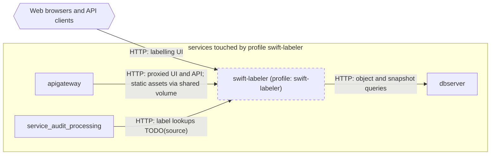

# Profile: `swift-labeler`

**Display name:** Swift Labeler

Should Swift Labeler be enabled?

| Attribute | Value |
|---|---|
| Fragment | `compose/docker-compose.swift-labeler.yml` |
| Class | prompted, default off |
| Prompt | Enable Swift Labeler? |
| Parent profile(s) | none |
| Sub-profiles | none |
| Requires (`required-profiles`) | none |
| Required by | none |
| Conflicts with (inferred) | none found |

## Services added

| Service | Node ID | Image | Owning repo | Purpose |
|---|---|---|---|---|
| `swift-labeler` | `swift_labeler` | `pacefactory/swift-labeler:${SWIFT_LABELER_TAG:-latest}` | [swift-labeler](https://github.com/pacefactory/swift-labeler) (internal) | Swift Labeler labelling UI and API |

## Services modified from other profiles

| Service | Home profile | Keys this profile adds or overrides |
|---|---|---|
| `apigateway` | [`base`](base.md) | depends_on, environment, volumes |
| `service_audit_processing` | [`base`](base.md) | depends_on, environment |

## Networks and volumes added

- Networks: none
- Named volumes: swift-labeler-data, swift-labeler-static

## Settings (`x-pf-info.settings`)

| Variable | Default (as written) | Hidden | default_var | Description |
|---|---|---|---|---|
| `SWIFT_LABELER_TAG` | `latest` | false |  | (none in fragment) |
| `SWIFT_LABELER_PUBLIC_PORT` | `7474` | false |  | (none in fragment) |

See the [environment variable reference](../../reference/environment-variables.md) for where each value reaches.

## Inputs / Outputs

Flows this profile originates or terminates. Node IDs are defined in the [glossary](../glossary.md).

| From | To | Direction | Protocol | Port / endpoint / topic / table | Payload | Trigger | Profile | Details |
|---|---|---|---|---|---|---|---|---|
| `swift_labeler` | `dbserver` | internal | HTTP | dbserver (port TODO(source)) | object and snapshot queries | on demand | swift-labeler | source: `compose/docker-compose.swift-labeler.yml:26`; [link](https://github.com/pacefactory/swift-labeler/blob/main/docs/architecture/README.md) |
| `ext_web_clients` | `swift_labeler` | in | HTTP | host port SWIFT_LABELER_PUBLIC_PORT (default 7474) | labelling UI | on demand | swift-labeler | source: `compose/docker-compose.swift-labeler.yml:14-15`; [link](https://github.com/pacefactory/swift-labeler/blob/main/docs/architecture/README.md) |
| `apigateway` | `swift_labeler` | internal | HTTP | swift-labeler:7474 (/swift) | proxied UI and API; static assets via shared volume | on demand | swift-labeler | source: `compose/docker-compose.swift-labeler.yml:41-45`; [link](https://github.com/pacefactory/scv2_apigateway/blob/main/docs/architecture/README.md) |
| `service_audit_processing` | `swift_labeler` | internal | HTTP | swift-labeler:7474/swift | label lookups TODO(source) | on demand | swift-labeler | source: `compose/docker-compose.swift-labeler.yml:51`; [link](https://github.com/pacefactory/scv3_services_processing/blob/main/docs/architecture/README.md) |

## Diagram

Source: [`swift-labeler.mmd`](swift-labeler.mmd). Dashed boxes are services from optional profiles; hexagons are external systems.

