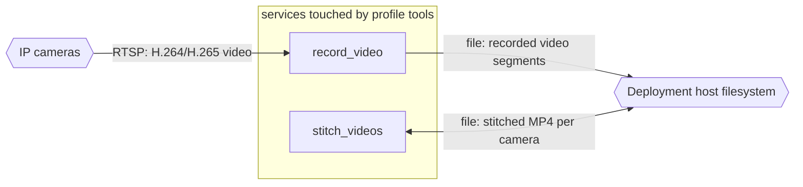

# Profile: `tools`

**Display name:** Tools profile

Tools profile contains useful utilities that can be run on-demand with `docker compose run tool_name ...`

| Attribute | Value |
|---|---|
| Fragment | `compose/docker-compose.tools.yml` |
| Class | forced (build.sh) |
| Prompt | (default: "Enable Tools profile?") |
| Parent profile(s) | none |
| Sub-profiles | none |
| Requires (`required-profiles`) | none |
| Required by | none |
| Conflicts with (inferred) | none found |

## Services added

| Service | Node ID | Image | Owning repo | Purpose |
|---|---|---|---|---|
| `record_video` | `record_video` | `pacefactory/realtime:${REALTIME_TAG:-latest}` | [deployment-scripts](https://github.com/pacefactory/deployment-scripts) (internal) | On-demand tool: records an RTSP camera stream to the host (record_cli.py) |
| `stitch_videos` | `stitch_videos` | `pacefactory/realtime:${REALTIME_TAG:-latest}` | [deployment-scripts](https://github.com/pacefactory/deployment-scripts) (internal) | On-demand tool: stitches recorded segments into one file per camera (stitch_cli.py) |

## Services modified from other profiles

None.

## Networks and volumes added

- Networks: none
- Named volumes: none

## Settings (`x-pf-info.settings`)

None.

## Inputs / Outputs

Flows this profile originates or terminates. Node IDs are defined in the [glossary](../glossary.md).

| From | To | Direction | Protocol | Port / endpoint / topic / table | Payload | Trigger | Profile | Details |
|---|---|---|---|---|---|---|---|---|
| `ext_cameras` | `record_video` | in | RTSP | rtsp:// URL of the selected camera | H.264/H.265 video | on demand | tools | source: `record_cli.py:96-134`; record_cli.py |
| `record_video` | `ext_host_fs` | out | file | ~/scv2/videos/<date>/<camera>/ | recorded video segments | on demand | tools | source: `compose/docker-compose.tools.yml:23; record_cli.py`; record_cli.py |
| `stitch_videos` | `ext_host_fs` | bidi | file | ~/scv2/videos/<date>/ | stitched MP4 per camera | on demand | tools | source: `compose/docker-compose.tools.yml:42; stitch_cli.py`; stitch_cli.py |

## Diagram

Source: [`tools.mmd`](tools.mmd). Dashed boxes are services from optional profiles; hexagons are external systems.

