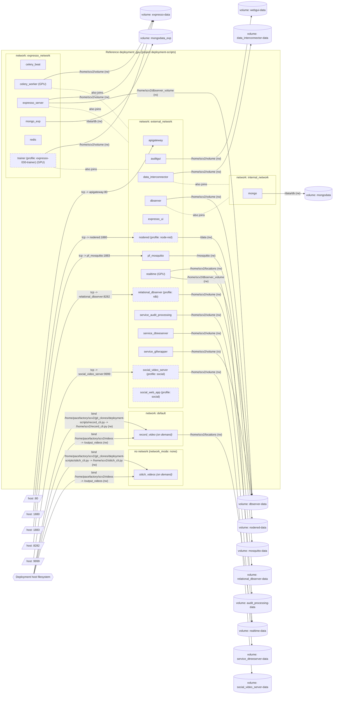
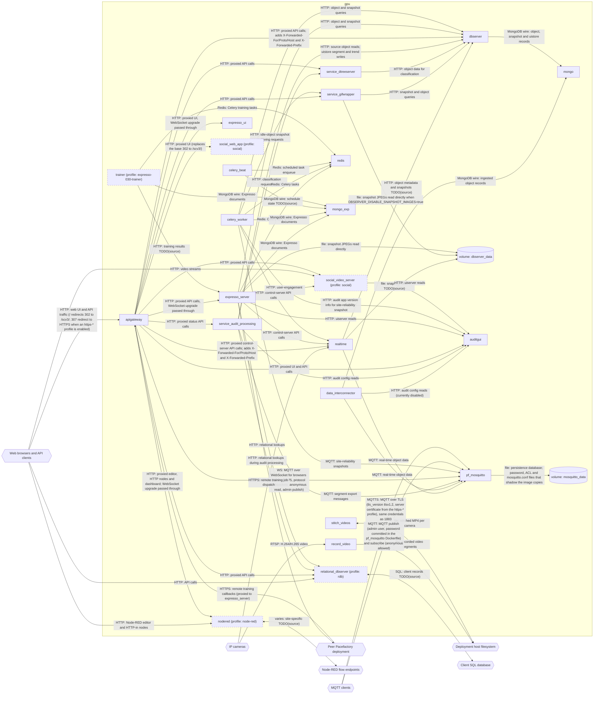
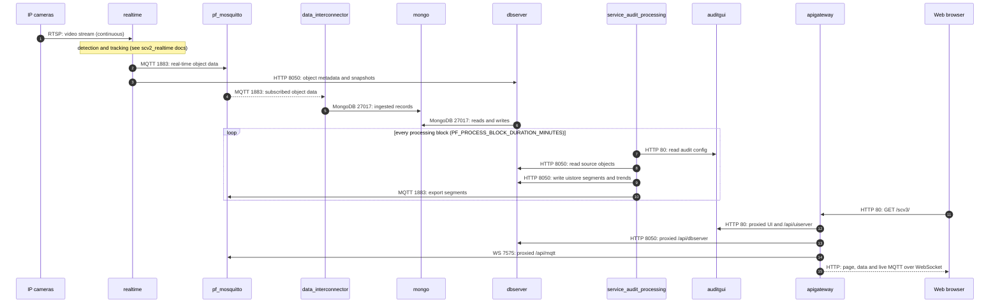

# Reference deployment: GPU variant

The default build with CUDA enabled for realtime and Expresso, plus the Expresso trainer worker. Requires an NVIDIA GPU and the nvidia container runtime on the host.

Host CUDA setup: see [Install CUDA support](../../../how-to/install-cuda-support.md) (placeholder).

## Reproduce

From the repository root, with mikefarah `yq` v4 and the docker compose plugin installed (no daemon required):

```bash
./scripts/docs/build-reference-deployment.sh gpu          # rewrite docker-compose.built.yml
./scripts/docs/build-reference-deployment.sh gpu --check  # exit 1 if the committed output is stale
```

The wrapper copies the recorded [`.env`](.env) and [`.settings`](.settings) into the repo root, runs `./build.sh -q -n deployment-scripts`, and normalises host paths to the canonical checkout `/home/pacefactory/scv2/git_clones/deployment-scripts`. The `docker compose config` command build.sh assembled on the last run is recorded in [`build-command.txt`](build-command.txt):

```bash
docker compose --project-name deployment-scripts --env-file .env --profile base --profile cuda --profile mqtt-public --profile expresso-010 --profile expresso-020-cuda --profile expresso-030-trainer --profile node-red --profile rdb --profile social --profile tools -f compose/docker-compose.base.yml -f compose/docker-compose.cuda.yml -f compose/docker-compose.mqtt-public.yml -f compose/docker-compose.expresso-010.yml -f compose/docker-compose.expresso-020-cuda.yml -f compose/docker-compose.expresso-030-trainer.yml -f compose/docker-compose.node-red.yml -f compose/docker-compose.rdb.yml -f compose/docker-compose.social.yml -f compose/docker-compose.tools.yml config
```

## Recorded inputs

Notable overrides: `REALTIME_TAG_DEFAULT_GPU` and `EXPRESSO_SERVER_TAG_DEFAULT_GPU` set to `latest-gpu` by the hidden settings of the CUDA sub-profiles.

`.env`:

```bash
REALTIME_TAG_DEFAULT_GPU=latest-gpu
MONGO_MEMORY_LIMIT=4g
MONGO_WIREDTIGER_CACHE_GB=1.5
EXPRESSO_SERVER_TAG_DEFAULT_GPU=latest-gpu
```

`.settings`:

```bash
declare -A SCV2_PROFILES=([custom]="true" [expresso-020-cuda]="true" [rdb]="true" [mqtt-public]="true" [expresso-010]="true" [base]="true" [social]="true" [node-red]="true" [expresso-030-trainer]="true" [cuda]="true" [mqtts-public]="true" [tools]="true" )
declare -- PROJECT_NAME="deployment-scripts"
```

## Profiles enabled

| Profile | Class | Page |
|---|---|---|
| `base` | forced (build.sh) | [base](../../profiles/base.md) |
| `cuda` | sub-profile of base, default off | [cuda](../../profiles/cuda.md) |
| `expresso-010` | forced (build.sh) | [expresso-010](../../profiles/expresso-010.md) |
| `expresso-020-cuda` | sub-profile of expresso-010, default off | [expresso-020-cuda](../../profiles/expresso-020-cuda.md) |
| `expresso-030-trainer` | sub-profile of expresso-010, default off | [expresso-030-trainer](../../profiles/expresso-030-trainer.md) |
| `mqtt-public` | sub-profile of base, default on | [mqtt-public](../../profiles/mqtt-public.md) |
| `mqtts-public` | sub-profile of https-digitalocean, https-godaddy, https-manual, https-no-certbot, default on | [mqtts-public](../../profiles/mqtts-public.md) |
| `node-red` | prompted, default on | [node-red](../../profiles/node-red.md) |
| `rdb` | prompted, default on | [rdb](../../profiles/rdb.md) |
| `social` | prompted, default on | [social](../../profiles/social.md) |
| `tools` | forced (build.sh) | [tools](../../profiles/tools.md) |

Profiles marked true in `.settings` but without a fragment in this checkout (for example `custom`) are ignored by `build.sh`.

## Services

| Service | Node ID | Image (resolved) | Home profile | Networks | Host ports | Notes |
|---|---|---|---|---|---|---|
| `apigateway` | `apigateway` | `pacefactory/apigateway:latest` | [`base`](../../profiles/base.md) | external_network | 80->80 |  |
| `auditgui` | `auditgui` | `pacefactory/scv3_webgui:latest` | [`base`](../../profiles/base.md) | external_network | none |  |
| `celery_beat` | `celery_beat` | `pacefactory/expresso_server:latest-gpu` | [`expresso-010`](../../profiles/expresso-010.md) | expresso_network | none |  |
| `celery_worker` | `celery_worker` | `pacefactory/expresso_server:latest-gpu` | [`expresso-010`](../../profiles/expresso-010.md) | expresso_network, external_network | none | GPU reservation |
| `data_interconnector` | `data_interconnector` | `pacefactory/data_interconnector:latest` | [`base`](../../profiles/base.md) | external_network, internal_network | none |  |
| `dbserver` | `dbserver` | `pacefactory/dbserver:latest` | [`base`](../../profiles/base.md) | external_network, internal_network | none |  |
| `expresso_server` | `expresso_server` | `pacefactory/expresso_server:latest-gpu` | [`expresso-010`](../../profiles/expresso-010.md) | expresso_network, external_network | none |  |
| `expresso_ui` | `expresso_ui` | `pacefactory/expresso_ui:latest` | [`expresso-010`](../../profiles/expresso-010.md) | external_network | none |  |
| `mongo` | `mongo` | `mongo:4.2.3-bionic` | [`base`](../../profiles/base.md) | internal_network | none |  |
| `mongo_exp` | `mongo_exp` | `mongodb/mongodb-community-server:8.2.1-ubi8` | [`expresso-010`](../../profiles/expresso-010.md) | expresso_network | none |  |
| `nodered` | `nodered` | `nodered/node-red:4.0.5-22` | [`node-red`](../../profiles/node-red.md) | external_network | 1880->1880 |  |
| `pf_mosquitto` | `pf_mosquitto` | `pacefactory/pf_mosquitto:latest` | [`base`](../../profiles/base.md) | external_network | 1883->1883 |  |
| `realtime` | `realtime` | `pacefactory/realtime:latest-gpu` | [`base`](../../profiles/base.md) | external_network | none | GPU reservation |
| `record_video` | `record_video` | `pacefactory/realtime:latest` | [`tools`](../../profiles/tools.md) | default | none | on demand (compose profile); restart: no |
| `redis` | `redis` | `redis:8.2.1-alpine` | [`expresso-010`](../../profiles/expresso-010.md) | expresso_network | none |  |
| `relational_dbserver` | `relational_dbserver` | `pacefactory/relational-dbserver:latest` | [`rdb`](../../profiles/rdb.md) | external_network | 8282->8282 |  |
| `service_audit_processing` | `service_audit_processing` | `pacefactory/service-audit-processing:latest` | [`base`](../../profiles/base.md) | external_network | none |  |
| `service_dtreeserver` | `service_dtreeserver` | `pacefactory/service-dtreeserver:latest` | [`base`](../../profiles/base.md) | external_network | none |  |
| `service_gifwrapper` | `service_gifwrapper` | `pacefactory/service-gifwrapper:latest` | [`base`](../../profiles/base.md) | external_network | none |  |
| `social_video_server` | `social_video_server` | `pacefactory/social_video_server:latest` | [`social`](../../profiles/social.md) | external_network | 9999->9999 |  |
| `social_web_app` | `social_web_app` | `pacefactory/social_web_app:latest` | [`social`](../../profiles/social.md) | external_network | none |  |
| `stitch_videos` | `stitch_videos` | `pacefactory/realtime:latest` | [`tools`](../../profiles/tools.md) | none | none | on demand (compose profile); restart: no |
| `trainer` | `trainer` | `pacefactory/trainer:latest` | [`expresso-030-trainer`](../../profiles/expresso-030-trainer.md) | expresso_network, external_network | none | GPU reservation |

## Host-published ports

| Host | Container | Protocol | Notes |
|---|---|---|---|
| 80 | `apigateway:80` | tcp |  |
| 1880 | `nodered:1880` | tcp |  |
| 1883 | `pf_mosquitto:1883` | tcp |  |
| 8282 | `relational_dbserver:8282` | tcp |  |
| 9999 | `social_video_server:9999` | tcp |  |

## Volumes

| Volume | Mounted by |
|---|---|
| `audit_processing-data` | `service_audit_processing` |
| `data_interconnector-data` | `data_interconnector` |
| `dbserver-data` | `dbserver`, `expresso_server`, `realtime`, `service_gifwrapper` |
| `expresso-data` | `celery_worker`, `expresso_server`, `trainer` |
| `mongodata` | `mongo` |
| `mongodata_exp` | `mongo_exp` |
| `mosquitto-data` | `pf_mosquitto` |
| `nodered-data` | `nodered` |
| `realtime-data` | `realtime`, `record_video` |
| `relational_dbserver-data` | `relational_dbserver` |
| `service_dtreeserver-data` | `service_dtreeserver` |
| `social_video_server-data` | `social_video_server` |
| `webgui-data` | `auditgui` |

## Inputs / Outputs (flow table)

One row per directed flow (standard §7a). Node IDs are defined in the [glossary](../../glossary.md); external systems are catalogued under [integrations](../../integrations/README.md).

| From | To | Direction | Protocol | Port / endpoint / topic / table | Payload | Trigger | Profile | Details |
|---|---|---|---|---|---|---|---|---|
| `ext_cameras` | `realtime` | in | RTSP | rtsp:// URL per camera (from realtime-data config) | H.264/H.265 video | continuous | base | source: `record_cli.py:15,96-97,129-134 (RTSP config shared with realtime; realtime's own ingest is TODO(source))`; [link](https://github.com/pacefactory/scv2_realtime/blob/main/docs/architecture/README.md) |
| `realtime` | `dbserver` | internal | HTTP | dbserver:8050 | object metadata and snapshots TODO(source) | continuous | base | source: `compose/docker-compose.base.yml:232`; [link](https://github.com/pacefactory/scv2_realtime/blob/main/docs/architecture/README.md) |
| `realtime` | `pf_mosquitto` | internal | MQTT | pf_mosquitto:1883 | real-time object data | continuous | base | source: `compose/docker-compose.base.yml:234-235`; [link](https://github.com/pacefactory/scv2_realtime/blob/main/docs/architecture/README.md) |
| `realtime` | `vol_dbserver_data` | internal | file | /home/scv2/dbserver_volume (rw mount of dbserver-data) | snapshot files TODO(source) | continuous | base | source: `compose/docker-compose.base.yml:236-239`; [link](https://github.com/pacefactory/scv2_realtime/blob/main/docs/architecture/README.md) |
| `data_interconnector` | `pf_mosquitto` | internal | MQTT | pf_mosquitto:1883 (subscribe) | real-time object data | continuous | base | source: `compose/docker-compose.base.yml:206-207`; [link](https://github.com/pacefactory/data_interconnector/blob/main/docs/architecture/README.md) |
| `data_interconnector` | `mongo` | internal | MongoDB wire | mongo:27017 | ingested object records | continuous | base | source: `compose/docker-compose.base.yml:208-209`; [link](https://github.com/pacefactory/data_interconnector/blob/main/docs/architecture/README.md) |
| `data_interconnector` | `auditgui` | internal | HTTP | auditgui:80 (disabled: PF_UISERVER_DISABLED=1) | audit config reads (currently disabled) | polling TODO(source) | base | source: `compose/docker-compose.base.yml:210-212`; [link](https://github.com/pacefactory/data_interconnector/blob/main/docs/architecture/README.md) |
| `dbserver` | `mongo` | internal | MongoDB wire | mongo:27017 | object, snapshot and uistore records | on demand | base | source: `compose/docker-compose.base.yml:158`; [link](https://github.com/pacefactory/scv2_dbserver/blob/main/docs/architecture/README.md) |
| `service_gifwrapper` | `dbserver` | internal | HTTP | dbserver:8050 | snapshot and object queries | on demand | base | source: `compose/docker-compose.base.yml:288`; [link](https://github.com/pacefactory/scv2_services_gifwrapper/blob/main/docs/architecture/README.md) |
| `service_gifwrapper` | `vol_dbserver_data` | internal | file | /home/scv2/volume (ro mount of dbserver-data) | snapshot JPEGs read directly when DBSERVER_DISABLE_SNAPSHOT_IMAGES=true | on demand | base | source: `compose/docker-compose.base.yml:289-292`; [link](https://github.com/pacefactory/scv2_services_gifwrapper/blob/main/docs/architecture/README.md) |
| `service_dtreeserver` | `dbserver` | internal | HTTP | dbserver:8050 | object data for classification | on demand | base | source: `compose/docker-compose.base.yml:305`; [link](https://github.com/pacefactory/scv2_services_dtreeserver/blob/main/docs/architecture/README.md) |
| `service_audit_processing` | `dbserver` | internal | HTTP | dbserver:8050 | source object reads; uistore segment and trend writes | polling (block schedule, PF_PROCESS_BLOCK_*) | base | source: `compose/docker-compose.base.yml:324`; [link](https://github.com/pacefactory/scv3_services_processing/blob/main/docs/architecture/README.md) |
| `service_audit_processing` | `auditgui` | internal | HTTP | auditgui:80 | audit config reads | polling | base | source: `compose/docker-compose.base.yml:325`; [link](https://github.com/pacefactory/scv3_services_processing/blob/main/docs/architecture/README.md) |
| `service_audit_processing` | `service_dtreeserver` | internal | HTTP | service_dtreeserver:7272 | classification requests | on event | base | source: `compose/docker-compose.base.yml:326`; [link](https://github.com/pacefactory/scv3_services_processing/blob/main/docs/architecture/README.md) |
| `service_audit_processing` | `pf_mosquitto` | internal | MQTT | pf_mosquitto:1883 (PF_MQTT_URL) | segment export messages | on event | base | source: `compose/docker-compose.base.yml:327`; [link](https://github.com/pacefactory/scv3_services_processing/blob/main/docs/architecture/README.md) |
| `apigateway` | `dbserver` | internal | HTTP | dbserver:8050 (/api/dbserver/) | proxied API calls; adds X-Forwarded-For/Proto/Host and X-Forwarded-Prefix | on demand | base | source: `compose/docker-compose.base.yml:347-348`; [link](https://github.com/pacefactory/scv2_apigateway/blob/master/docs/reference/api.md) |
| `apigateway` | `service_dtreeserver` | internal | HTTP | service_dtreeserver:7272 (/api/dtree_classifier/) | proxied API calls | on demand | base | source: `compose/docker-compose.base.yml:349-350`; [link](https://github.com/pacefactory/scv2_apigateway/blob/master/docs/reference/api.md) |
| `apigateway` | `service_gifwrapper` | internal | HTTP | service_gifwrapper:7171 (/api/gif/) | proxied API calls | on demand | base | source: `compose/docker-compose.base.yml:351-352`; [link](https://github.com/pacefactory/scv2_apigateway/blob/master/docs/reference/api.md) |
| `apigateway` | `realtime` | internal | HTTP | realtime:8181 (/api/realtime/) | proxied control-server API calls; adds X-Forwarded-For/Proto/Host and X-Forwarded-Prefix | on demand | base | source: `compose/docker-compose.base.yml:353-354`; [link](https://github.com/pacefactory/scv2_apigateway/blob/master/docs/reference/api.md) |
| `apigateway` | `auditgui` | internal | HTTP | auditgui:80 (/scv3/, /api/uiserver/; / answers 302 to scv3/) | proxied UI and API calls | on demand | base | source: `compose/docker-compose.base.yml:355-356`; [link](https://github.com/pacefactory/scv2_apigateway/blob/master/docs/reference/api.md) |
| `apigateway` | `service_audit_processing` | internal | HTTP | service_audit_processing:3005 (/api/proc/) | proxied status API calls | on demand | base | source: `compose/docker-compose.base.yml:357-358`; [link](https://github.com/pacefactory/scv2_apigateway/blob/master/docs/reference/api.md) |
| `apigateway` | `pf_mosquitto` | internal | WS | pf_mosquitto:7575 (/api/mqtt) | MQTT over WebSocket for browsers (listener 7575, protocol websockets; anonymous read, admin publish) | continuous | base | source: `compose/docker-compose.base.yml:359-361`; [link](https://github.com/pacefactory/pf_mosquitto/blob/master/docs/architecture/README.md) |
| `pf_mosquitto` | `vol_mosquitto_data` | internal | file | /mosquitto (rw mount of mosquitto-data): persistence at /mosquitto/data/, config at /mosquitto/config/ | persistence database; password, ACL and mosquitto.conf files that shadow the image copies | continuous | base | source: `compose/docker-compose.base.yml:191`; [link](https://github.com/pacefactory/pf_mosquitto/blob/master/docs/architecture/README.md) |
| `ext_web_clients` | `apigateway` | in | HTTP | host port HTTP_PORT (default 80) | web UI and API traffic (/ redirects 302 to /scv3/; 307 redirect to HTTPS when an https-* profile is enabled) | on demand | base | source: `compose/docker-compose.base.yml:369-370`; [link](https://github.com/pacefactory/scv2_apigateway/blob/master/docs/reference/api.md#listeners) |
| `ext_cameras` | `record_video` | in | RTSP | rtsp:// URL of the selected camera | H.264/H.265 video | on demand | tools | source: `record_cli.py:96-134`; record_cli.py |
| `record_video` | `ext_host_fs` | out | file | ~/scv2/videos/<date>/<camera>/ | recorded video segments | on demand | tools | source: `compose/docker-compose.tools.yml:23; record_cli.py`; record_cli.py |
| `stitch_videos` | `ext_host_fs` | bidi | file | ~/scv2/videos/<date>/ | stitched MP4 per camera | on demand | tools | source: `compose/docker-compose.tools.yml:42; stitch_cli.py`; stitch_cli.py |
| `expresso_server` | `redis` | internal | Redis | redis (port TODO(source), default 6379) | Celery task queue | on event | expresso-010 | source: `compose/docker-compose.expresso-010.yml:58`; [link](https://github.com/pacefactory/expresso_server/blob/main/docs/architecture/README.md) |
| `expresso_server` | `mongo_exp` | internal | MongoDB wire | mongo_exp:27017 | Expresso documents | on demand | expresso-010 | source: `compose/docker-compose.expresso-010.yml:60`; [link](https://github.com/pacefactory/expresso_server/blob/main/docs/architecture/README.md) |
| `expresso_server` | `realtime` | internal | HTTP | realtime:8181 | control-server API calls | on demand | expresso-010 | source: `compose/docker-compose.expresso-010.yml:61-62`; [link](https://github.com/pacefactory/expresso_server/blob/main/docs/architecture/README.md) |
| `expresso_server` | `dbserver` | internal | HTTP | dbserver:8050 | object and snapshot queries | on demand | expresso-010 | source: `compose/docker-compose.expresso-010.yml:66-67`; [link](https://github.com/pacefactory/expresso_server/blob/main/docs/architecture/README.md) |
| `expresso_server` | `vol_dbserver_data` | internal | file | /home/scv2/dbserver_volume (ro mount of dbserver-data) | snapshot JPEGs read directly | on demand | expresso-010 | source: `compose/docker-compose.expresso-010.yml:47-50,75`; [link](https://github.com/pacefactory/expresso_server/blob/main/docs/architecture/README.md) |
| `expresso_server` | `auditgui` | internal | HTTP | auditgui:80 | uiserver reads | on demand | expresso-010 | source: `compose/docker-compose.expresso-010.yml:59`; [link](https://github.com/pacefactory/expresso_server/blob/main/docs/architecture/README.md) |
| `expresso_server` | `social_video_server` | internal | HTTP | social_video_server:9999 (tolerated unreachable without social) | user-engagement metrics | on demand | expresso-010 | source: `compose/docker-compose.expresso-010.yml:76-80`; [link](https://github.com/pacefactory/expresso_server/blob/main/docs/architecture/README.md) |
| `expresso_server` | `ext_peer_deployment` | out | HTTPS | PF_REMOTE_TRAINER_URLS (<peer>/api/expresso) | remote training job dispatch | on demand | expresso-010 | source: `compose/docker-compose.expresso-010.yml:30-35,89-91`; [link](https://github.com/pacefactory/expresso_server/blob/main/docs/architecture/README.md) |
| `ext_peer_deployment` | `apigateway` | in | HTTPS | PF_EXPRESSO_PUBLIC_URL_BASE/training/remote/callback | remote training callbacks (proxied to expresso_server) | on event | expresso-010 | source: `compose/docker-compose.expresso-010.yml:23-29,84-88`; [link](https://github.com/pacefactory/expresso_server/blob/main/docs/architecture/README.md) |
| `celery_worker` | `redis` | internal | Redis | redis | Celery tasks | on event | expresso-010 | source: `compose/docker-compose.expresso-010.yml:180`; [link](https://github.com/pacefactory/expresso_server/blob/main/docs/architecture/README.md) |
| `celery_worker` | `mongo_exp` | internal | MongoDB wire | mongo_exp:27017 | Expresso documents | on demand | expresso-010 | source: `compose/docker-compose.expresso-010.yml:181`; [link](https://github.com/pacefactory/expresso_server/blob/main/docs/architecture/README.md) |
| `celery_worker` | `realtime` | internal | HTTP | realtime:8181 | control-server API calls | on demand | expresso-010 | source: `compose/docker-compose.expresso-010.yml:182-183`; [link](https://github.com/pacefactory/expresso_server/blob/main/docs/architecture/README.md) |
| `celery_worker` | `dbserver` | internal | HTTP | dbserver:8050 | object and snapshot queries | on demand | expresso-010 | source: `compose/docker-compose.expresso-010.yml:187-188`; [link](https://github.com/pacefactory/expresso_server/blob/main/docs/architecture/README.md) |
| `celery_worker` | `pf_mosquitto` | internal | MQTT | pf_mosquitto:1883 | site-reliability snapshots | polling (celery beat schedule) | expresso-010 | source: `compose/docker-compose.expresso-010.yml:192-195`; [link](https://github.com/pacefactory/expresso_server/blob/main/docs/architecture/README.md) |
| `celery_worker` | `service_gifwrapper` | internal | HTTP | service_gifwrapper:7171 | idle-object snapshot archiving requests | polling (celery beat schedule) | expresso-010 | source: `compose/docker-compose.expresso-010.yml:196-199`; [link](https://github.com/pacefactory/expresso_server/blob/main/docs/architecture/README.md) |
| `celery_worker` | `auditgui` | internal | HTTP | auditgui:80 | audit app version info for site-reliability snapshot | polling | expresso-010 | source: `compose/docker-compose.expresso-010.yml:204-205`; [link](https://github.com/pacefactory/expresso_server/blob/main/docs/architecture/README.md) |
| `celery_beat` | `redis` | internal | Redis | redis | scheduled task enqueue | polling (schedule) | expresso-010 | source: `compose/docker-compose.expresso-010.yml:227`; [link](https://github.com/pacefactory/expresso_server/blob/main/docs/architecture/README.md) |
| `celery_beat` | `mongo_exp` | internal | MongoDB wire | mongo_exp:27017 | schedule state TODO(source) | polling | expresso-010 | source: `compose/docker-compose.expresso-010.yml:228`; [link](https://github.com/pacefactory/expresso_server/blob/main/docs/architecture/README.md) |
| `apigateway` | `expresso_server` | internal | HTTP | expresso_server:8456 (/api/expresso/) | proxied API calls, WebSocket upgrade passed through | on demand | expresso-010 | source: `compose/docker-compose.expresso-010.yml:253-254`; [link](https://github.com/pacefactory/scv2_apigateway/blob/master/docs/reference/api.md) |
| `apigateway` | `expresso_ui` | internal | HTTP | expresso_ui:80 (/expresso/) | proxied UI, WebSocket upgrade passed through | on demand | expresso-010 | source: `compose/docker-compose.expresso-010.yml:255-256`; [link](https://github.com/pacefactory/scv2_apigateway/blob/master/docs/reference/api.md) |
| `trainer` | `redis` | internal | Redis | redis | Celery training tasks | on event | expresso-030-trainer | source: `compose/docker-compose.expresso-030-trainer.yml:29`; [link](https://github.com/pacefactory/trainer/blob/main/docs/architecture/README.md) |
| `trainer` | `mongo_exp` | internal | MongoDB wire | mongo_exp:27017 | Expresso documents | on demand | expresso-030-trainer | source: `compose/docker-compose.expresso-030-trainer.yml:30`; [link](https://github.com/pacefactory/trainer/blob/main/docs/architecture/README.md) |
| `trainer` | `expresso_server` | internal | HTTP | expresso_server (port TODO(source), 8456 expected) | training results TODO(source) | on event | expresso-030-trainer | source: `compose/docker-compose.expresso-030-trainer.yml:32`; [link](https://github.com/pacefactory/trainer/blob/main/docs/architecture/README.md) |
| `social_video_server` | `auditgui` | internal | HTTP | auditgui:80 | uiserver reads | on demand | social | source: `compose/docker-compose.social.yml:42`; [link](https://github.com/pacefactory/social_video_server/blob/main/docs/architecture/README.md) |
| `ext_web_clients` | `social_video_server` | in | HTTP | host port SOCIAL_VIDEO_PUBLIC_PORT (default 9999) | video streams | on demand | social | source: `compose/docker-compose.social.yml:43-44`; [link](https://github.com/pacefactory/social_video_server/blob/main/docs/architecture/README.md) |
| `apigateway` | `social_video_server` | internal | HTTP | social_video_server:9999 (/api/video/) | proxied API calls | on demand | social | source: `compose/docker-compose.social.yml:56`; [link](https://github.com/pacefactory/scv2_apigateway/blob/master/docs/reference/api.md) |
| `apigateway` | `social_web_app` | internal | HTTP | social_web_app:80 (/; SOCIAL_VIDO_APP_HOST carries no port, so nginx uses the http default 80) | proxied UI (replaces the base 302 to /scv3/) | on demand | social | source: `compose/docker-compose.social.yml:57; scv2_apigateway etc/nginx/templates.social/locations/root.conf.template`; [link](https://github.com/pacefactory/scv2_apigateway/blob/master/docs/reference/api.md) |
| `relational_dbserver` | `ext_client_sql` | bidi | SQL | client database host and driver TODO(source) | client records TODO(source) | on demand | rdb | source: `compose/docker-compose.rdb.yml:5-7`; [link](https://github.com/pacefactory/scv2_relational_dbserver/blob/main/docs/architecture/README.md) |
| `ext_web_clients` | `relational_dbserver` | in | HTTP | host port RDB_PUBLIC_PORT (default 8282) | API calls | on demand | rdb | source: `compose/docker-compose.rdb.yml:22-23`; [link](https://github.com/pacefactory/scv2_relational_dbserver/blob/main/docs/architecture/README.md) |
| `apigateway` | `relational_dbserver` | internal | HTTP | relational_dbserver:8282 (/api/rdb/) | proxied API calls | on demand | rdb | source: `compose/docker-compose.rdb.yml:34-35`; [link](https://github.com/pacefactory/scv2_apigateway/blob/master/docs/reference/api.md) |
| `service_audit_processing` | `relational_dbserver` | internal | HTTP | relational_dbserver:8282 | relational lookups during audit processing | on demand | rdb | source: `compose/docker-compose.rdb.yml:43`; [link](https://github.com/pacefactory/scv3_services_processing/blob/main/docs/architecture/README.md) |
| `expresso_server` | `relational_dbserver` | internal | HTTP | relational_dbserver:8282 | relational lookups | on demand | rdb | source: `compose/docker-compose.rdb.yml:47`; [link](https://github.com/pacefactory/expresso_server/blob/main/docs/architecture/README.md) |
| `ext_web_clients` | `nodered` | in | HTTP | host port NODERED_PORT (default 1880) | Node-RED editor and HTTP-in nodes | on demand | node-red | source: `compose/docker-compose.node-red.yml:23-24`; [link](https://nodered.org/docs/) |
| `apigateway` | `nodered` | internal | HTTP | nodered:1880 (/api/nodered/, /dashboard/) | proxied editor, HTTP nodes and dashboard; WebSocket upgrade passed through | on demand | node-red | source: `compose/docker-compose.node-red.yml:35-36`; [link](https://github.com/pacefactory/scv2_apigateway/blob/master/docs/reference/api.md) |
| `nodered` | `ext_nodered_endpoints` | bidi | varies | configured per site in flows | site-specific TODO(source) | varies | node-red | source: `compose/docker-compose.node-red.yml (no endpoints in compose)`; [link](https://nodered.org/docs/) |
| `ext_mqtt_clients` | `pf_mosquitto` | in | MQTT | host port PF_MOSQUITTO_PUBLIC_PORT (default 1883) | MQTT publish (admin user, password committed in the pf_mosquitto Dockerfile) and subscribe (anonymous allowed) | continuous | mqtt-public | source: `compose/docker-compose.mqtt-public.yml:16-18`; [link](https://github.com/pacefactory/pf_mosquitto/blob/master/docs/architecture/README.md) |
| `ext_mqtt_clients` | `pf_mosquitto` | in | MQTTS | host port MQTTS_PUBLIC_PORT (default 8883) | MQTT over TLS (tls_version tlsv1.2, server certificate from the https-* profile), same credentials as 1883 | continuous | mqtts-public | source: `compose/docker-compose.mqtts-public.yml:18-24`; [link](https://github.com/pacefactory/pf_mosquitto/blob/master/docs/architecture/README.md) |

## Diagrams

### Topology

Source: [`topology.mmd`](topology.mmd), derived from `docker-compose.built.yml`. Services grouped by their first compose network; dotted edges show additional network membership; parallelograms are host-published ports; cylinders are named volumes; dashed boxes are optional-profile services.



### Data flows

Source: [`data-flows.mmd`](data-flows.mmd). One arrow per row of the flow table; hexagons are external systems.



### Request flows

Source: [`request-flows.mmd`](request-flows.mmd) (template `scripts/docs/request-flows/default.mmd`). Intra-service steps are collapsed to one note; see the owning service repo for internals.


