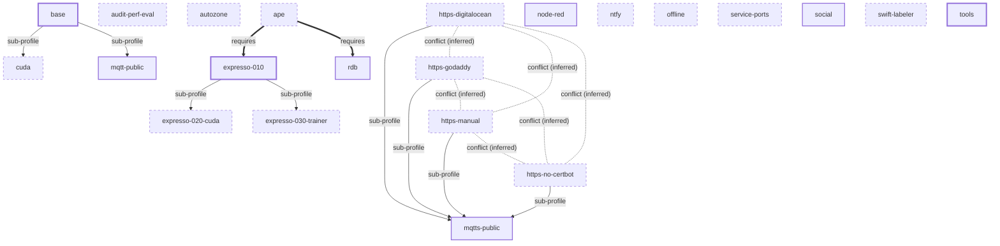

# Profile dependencies

Edges are derived from `x-pf-info.sub-profiles`, `x-pf-info.required-profiles`
and the forced/default-on constants in `build.sh`. Conflicts are **inferred**
(same container name or same default host port in two fragments); `build.sh`
has no conflict check and will happily assemble a conflicting selection, which
then fails at `docker compose up` with a port or name clash.

Legend: solid arrow `parent --> sub-profile` = offered after the parent is
enabled; thick arrow `A ==> B` = A force-enables B; dotted line = inferred
conflict; double-bordered boxes are forced profiles; dashed boxes are default-off.

## Table

| Profile | Class | Parent | Sub-profiles | Requires | Required by | Conflicts with (inferred) |
|---|---|---|---|---|---|---|
| [`ape`](../architecture/profiles/ape.md) | prompted, default off | none | none | [`expresso-010`](../architecture/profiles/expresso-010.md), [`rdb`](../architecture/profiles/rdb.md) | none | none found |
| [`audit-perf-eval`](../architecture/profiles/audit-perf-eval.md) | prompted, default off | none | none | none | none | none found |
| [`autozone`](../architecture/profiles/autozone.md) | prompted, default off | none | none | none | none | none found |
| [`base`](../architecture/profiles/base.md) | forced (build.sh) | none | [`cuda`](../architecture/profiles/cuda.md), [`mqtt-public`](../architecture/profiles/mqtt-public.md) | none | none | none found |
| [`cuda`](../architecture/profiles/cuda.md) | sub-profile of base, default off | [`base`](../architecture/profiles/base.md) | none | none | none | none found |
| [`expresso-010`](../architecture/profiles/expresso-010.md) | forced (build.sh) | none | [`expresso-020-cuda`](../architecture/profiles/expresso-020-cuda.md), [`expresso-030-trainer`](../architecture/profiles/expresso-030-trainer.md) | none | [`ape`](../architecture/profiles/ape.md) | none found |
| [`expresso-020-cuda`](../architecture/profiles/expresso-020-cuda.md) | sub-profile of expresso-010, default off | [`expresso-010`](../architecture/profiles/expresso-010.md) | none | none | none | none found |
| [`expresso-030-trainer`](../architecture/profiles/expresso-030-trainer.md) | sub-profile of expresso-010, default off | [`expresso-010`](../architecture/profiles/expresso-010.md) | none | none | none | none found |
| [`https-digitalocean`](../architecture/profiles/https-digitalocean.md) | prompted, default off | none | [`mqtts-public`](../architecture/profiles/mqtts-public.md) | none | none | `https-godaddy` (same container name certbot; same host port 443) `https-manual` (same container name certbot; same host port 443) `https-no-certbot` (same host port 443) |
| [`https-godaddy`](../architecture/profiles/https-godaddy.md) | prompted, default off | none | [`mqtts-public`](../architecture/profiles/mqtts-public.md) | none | none | `https-digitalocean` (same container name certbot; same host port 443) `https-manual` (same container name certbot; same host port 443) `https-no-certbot` (same host port 443) |
| [`https-manual`](../architecture/profiles/https-manual.md) | prompted, default off | none | [`mqtts-public`](../architecture/profiles/mqtts-public.md) | none | none | `https-digitalocean` (same container name certbot; same host port 443) `https-godaddy` (same container name certbot; same host port 443) `https-no-certbot` (same host port 443) |
| [`https-no-certbot`](../architecture/profiles/https-no-certbot.md) | prompted, default off | none | [`mqtts-public`](../architecture/profiles/mqtts-public.md) | none | none | `https-digitalocean` (same host port 443) `https-godaddy` (same host port 443) `https-manual` (same host port 443) |
| [`mqtt-public`](../architecture/profiles/mqtt-public.md) | sub-profile of base, default on | [`base`](../architecture/profiles/base.md) | none | none | none | none found |
| [`mqtts-public`](../architecture/profiles/mqtts-public.md) | sub-profile of https-digitalocean, https-godaddy, https-manual, https-no-certbot, default on | [`https-digitalocean`](../architecture/profiles/https-digitalocean.md), [`https-godaddy`](../architecture/profiles/https-godaddy.md), [`https-manual`](../architecture/profiles/https-manual.md), [`https-no-certbot`](../architecture/profiles/https-no-certbot.md) | none | none | none | none found |
| [`node-red`](../architecture/profiles/node-red.md) | prompted, default on | none | none | none | none | none found |
| [`ntfy`](../architecture/profiles/ntfy.md) | prompted, default off | none | none | none | none | none found |
| [`offline`](../architecture/profiles/offline.md) | prompted, default off | none | none | none | none | none found |
| [`rdb`](../architecture/profiles/rdb.md) | prompted, default on | none | none | none | [`ape`](../architecture/profiles/ape.md) | none found |
| [`service-ports`](../architecture/profiles/service-ports.md) | prompted, default off | none | none | none | none | none found |
| [`social`](../architecture/profiles/social.md) | prompted, default on | none | none | none | none | none found |
| [`swift-labeler`](../architecture/profiles/swift-labeler.md) | prompted, default off | none | none | none | none | none found |
| [`tools`](../architecture/profiles/tools.md) | forced (build.sh) | none | none | none | none | none found |
